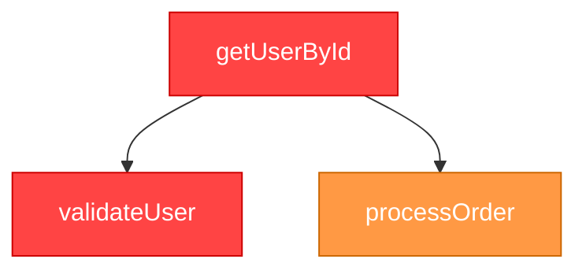

# How to Use Blast Radius Extension with Java Projects

## What This Extension Does

The Blast Radius extension analyzes the **impact of your code changes** in Java projects. When you modify a Java file, it:

1. **Detects what changed** (methods, classes)
2. **Finds all dependencies** (what other code uses your changes)
3. **Calculates risk levels** (how critical each impacted component is)
4. **Generates a visual report** showing the "blast radius" of your changes

## Real-World Use Case

**Scenario:** You're working on a Java microservice and need to modify a critical method.

**Before making changes:**
- You want to know: "What will break if I change this?"
- You want to see: "Which other classes/methods depend on this?"
- You need to assess: "How risky is this change?"

**This extension answers those questions automatically!**

---

## Step-by-Step Usage

### 1. **Open Your Java Project**

```bash
# Example: Open a Java project in VSCode
code /path/to/your/java-project
```

Your project should have:
- `.java` files
- A git repository (initialized with `git init`)
- Some uncommitted changes (or you can make changes)

### 2. **Make Changes to a Java File**

Open any `.java` file and make some changes:

```java
// Example: UserService.java
public class UserService {
    
    // You modify this method
    public User getUserById(String id) {
        // Your changes here
        return userRepository.findById(id);
    }
    
    // This method calls getUserById
    public List<User> getActiveUsers() {
        // This will be detected as a dependency
        return users.stream()
            .filter(u -> getUserById(u.getId()) != null)
            .collect(Collectors.toList());
    }
}
```

**Don't commit the changes yet!** The extension analyzes uncommitted changes.

### 3. **Run the Analysis**

With the Java file open in the editor:

1. Press `Ctrl+Shift+P` (Windows/Linux) or `Cmd+Shift+P` (Mac)
2. Type: `Blast Radius: Map`
3. Press Enter

### 4. **View the Results**

The extension will:
- Show progress in the Output panel
- Generate a markdown report
- Automatically open the report in preview mode

---

## Understanding the Report

### Example Report Structure

```markdown
# 🎯 Blast Radius Analysis Report

## 📋 Metadata
- Target File: `src/main/java/com/example/UserService.java`
- Analysis Time: 2024-01-15T10:30:00Z

## 📊 Summary
- Total Nodes: 12
- Total Edges: 8
- Overall Risk: 🟠 HIGH

## 🎨 Risk Distribution
| Risk Level | Count | Percentage |
|------------|-------|------------|
| 🔴 Critical | 2 | 16.7% |
| 🟠 High | 4 | 33.3% |
| 🟡 Medium | 3 | 25.0% |
| 🟢 Low | 3 | 25.0% |

## 🔍 Key Findings
1. Modified method `getUserById` is called by 5 other methods
2. Changes affect critical authentication flow
3. Database query optimization may impact performance

## 📦 Impacted Components

### 🔴 CRITICAL Risk (2)

#### UserService.getUserById
- Type: Method
- File: `src/main/java/com/example/UserService.java:45`
- Risk Score: 95/100
- Reasons:
  - Called by authentication system
  - Used in 5 different services
  - Part of critical user flow

#### AuthenticationService.validateUser
- Type: Method
- File: `src/main/java/com/example/AuthenticationService.java:23`
- Risk Score: 90/100
- Reasons:
  - Depends on modified getUserById method
  - Critical for security
  - High usage frequency

### 🟠 HIGH Risk (4)
...

## 🔗 Dependency Graph


```

---

## Practical Examples

### Example 1: Refactoring a Utility Method

**Scenario:** You want to refactor a commonly used utility method.

```java
// Before
public class StringUtils {
    public static String sanitize(String input) {
        return input.trim().toLowerCase();
    }
}
```

**Steps:**
1. Open `StringUtils.java`
2. Modify the `sanitize` method
3. Run `Blast Radius: Map`
4. **Report shows:** All 15 classes that use this method
5. **You learn:** This change affects authentication, validation, and logging
6. **Decision:** Add unit tests for all impacted areas before deploying

### Example 2: Changing a Database Query

**Scenario:** Optimizing a slow database query.

```java
// UserRepository.java
public List<User> findActiveUsers() {
    // Old: SELECT * FROM users WHERE active = true
    // New: SELECT id, name FROM users WHERE active = true AND deleted = false
    return entityManager.createQuery("...", User.class).getResultList();
}
```

**Steps:**
1. Open `UserRepository.java`
2. Modify the query
3. Run `Blast Radius: Map`
4. **Report shows:** 
   - 8 services depend on this method
   - 3 are marked as CRITICAL (authentication, billing, reporting)
5. **Decision:** Test thoroughly in staging before production

### Example 3: Adding a New Parameter

**Scenario:** Adding a new required parameter to a method.

```java
// Before
public void sendEmail(String to, String subject, String body) { }

// After
public void sendEmail(String to, String subject, String body, EmailPriority priority) { }
```

**Steps:**
1. Make the change
2. Run `Blast Radius: Map`
3. **Report shows:** All 23 places that call `sendEmail`
4. **You learn:** Need to update 23 call sites
5. **Decision:** Use method overloading for backward compatibility

---

## Integration with Development Workflow

### Before Code Review

```bash
# 1. Make your changes
vim src/main/java/com/example/UserService.java

# 2. Run Blast Radius analysis
# (Use VSCode command: Blast Radius: Map)

# 3. Review the report
# - Check risk levels
# - Identify impacted components
# - Plan testing strategy

# 4. Include report in PR description
cp reports/blast-radius-report.md .github/PR_IMPACT.md
```

### During Sprint Planning

Use the extension to:
- **Estimate complexity** of proposed changes
- **Identify risky refactorings** that need extra time
- **Plan testing efforts** based on blast radius

### Before Deployment

```bash
# Run analysis on all changed files
# Review critical and high-risk impacts
# Ensure adequate test coverage
# Plan rollback strategy for high-risk changes
```

---

## Advanced Usage

### Analyzing Multiple Files

Run the analysis on each changed file separately:

1. Open `FileA.java` → Run `Blast Radius: Map`
2. Open `FileB.java` → Run `Blast Radius: Map`
3. Compare reports to understand combined impact

### Comparing Before/After

```bash
# 1. Before changes
git stash
# Run analysis → Save report as "before.md"

# 2. After changes
git stash pop
# Run analysis → Save report as "after.md"

# 3. Compare
diff before.md after.md
```

### CI/CD Integration

Add to your pipeline:

```yaml
# .github/workflows/blast-radius.yml
name: Blast Radius Analysis

on: [pull_request]

jobs:
  analyze:
    runs-on: ubuntu-latest
    steps:
      - uses: actions/checkout@v2
      - name: Run Blast Radius
        run: |
          # Install extension
          # Run analysis
          # Upload report as artifact
```

---

## Tips for Best Results

### 1. **Keep Changes Small**
- Analyze one logical change at a time
- Smaller changes = clearer blast radius

### 2. **Run Before Committing**
- Analyze while changes are uncommitted
- Review impact before finalizing

### 3. **Use with Code Reviews**
- Include blast radius report in PRs
- Helps reviewers understand impact

### 4. **Focus on High-Risk Items**
- Pay special attention to CRITICAL and HIGH risk components
- Add extra tests for these areas

### 5. **Track Over Time**
- Save reports for major changes
- Compare blast radius across releases
- Identify areas that need refactoring

---

## Troubleshooting

### "No changes detected"
- Ensure you have uncommitted changes: `git status`
- Make sure the file is part of a git repository

### "AST analysis failed"
- Ensure Java project structure is correct
- Check that `.java` files compile
- Verify Maven/Gradle dependencies are resolved

### "Empty report"
- Check if the file has actual code changes
- Ensure the method/class is used elsewhere in the project
- Try with a more central class (e.g., service layer)

---

## What Makes a Good Candidate for Analysis?

**Best candidates:**
- ✅ Service layer classes (high connectivity)
- ✅ Utility methods (widely used)
- ✅ Data models (many dependencies)
- ✅ API controllers (critical paths)

**Less useful for:**
- ❌ Brand new files (no dependencies yet)
- ❌ Test files (isolated)
- ❌ Configuration files (not analyzed)

---

## Summary

The Blast Radius extension helps you:
1. **Understand impact** before making changes
2. **Identify risks** in your modifications
3. **Plan testing** based on dependencies
4. **Make informed decisions** about refactoring
5. **Communicate impact** to your team

**Remember:** The goal is to make safer, more informed code changes by understanding the full impact of your modifications!