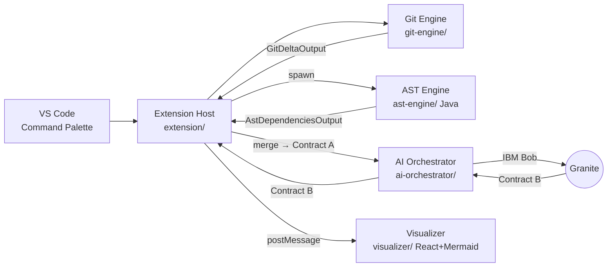

# Blast Radius Mapper

> A Visual Studio Code extension that acts as an AI-powered architectural safety net — it intercepts code changes locally, maps downstream dependencies deterministically with an AST, and uses IBM Bob (Granite) to evaluate the semantic risk of the change *before* a Pull Request is opened.

[]()
[]()
[](https://github.com/wso2/carbon-identity-framework)

---

## The Problem

Modern IDEs and compilers catch **structural** errors — wrong types, bad signatures, missing imports. They are **blind to semantic and logical** changes. If a developer cuts a network timeout from 50 s to 50 ms, the code compiles perfectly, but downstream services break silently.

## The Solution

Blast Radius Mapper is a VS Code extension that:

1. Intercepts a developer's local code change via the Command Palette.
2. Deterministically discovers every downstream Java caller using JavaParser's `CombinedTypeSolver` (handles multi-module Maven + OSGi bundles).
3. Asks IBM Bob to classify the risk of each caller given the exact `git diff` and the call-site source line.
4. Renders an interactive, color-coded Mermaid flowchart inside a VS Code webview — Critical (red), Warning (yellow), Low-Risk (orange), Safe (green).

All of this happens *before* the developer opens a PR.

---

## Architecture



The pipeline runs in five well-isolated components, glued together by four strict JSON contracts. See [docs/ARCHITECTURE.md](docs/ARCHITECTURE.md) and [docs/CONTRACTS.md](docs/CONTRACTS.md).

---

## The 4-Step Pipeline

1. **Trigger & Context** — Developer runs *Blast Radius: Map* in the Command Palette. The extension grabs the active Java file path and runs `git diff` to extract the modified lines and changed method names.
2. **AST Traversal** — A Maven-shaded fat-jar (JavaParser) scans the workspace, builds a global type solver against all `pom.xml` source roots plus JARs in `~/.m2`, finds every downstream `MethodCallExpr` referencing the changed methods, and emits a list of dependencies with usage-context lines.
3. **Semantic Risk Analysis** — The merged Contract A is sent to IBM Bob with seven system-prompt skills (see [visualizer/BOB-SKILLS-SPEC.md](visualizer/BOB-SKILLS-SPEC.md)). Bob returns Contract B — nodes with risk levels and reasons, plus typed edges. Zod validates the response and triggers self-healing retries on malformed output.
4. **Render** — Contract B is posted into a Vite-bundled React webview. Mermaid renders the graph, sub-grouped by Java package, colored by risk level.

---

## Component Map

| Member | Folder | Mission | Tech | Owns Contract |
|---|---|---|---|---|
| **1** | [extension/](extension/) | VS Code core, webview, orchestration, the **merge** of M2 + M3 output into Contract A | TypeScript, VS Code API | sees all 4 |
| **2** | [git-engine/](git-engine/) | Active file detection, `git diff` extraction, line-to-symbol mapping | TypeScript, Node `child_process`, Git CLI | produces `GitDeltaOutput` |
| **3** | [ast-engine/](ast-engine/) | Java static analysis via JavaParser, dependency discovery across Maven modules + OSGi bundles | Java 17, JavaParser, JavaSymbolSolver, Maven (shade plugin) | produces `AstDependenciesOutput` |
| **4** | [ai-orchestrator/](ai-orchestrator/) | IBM Bob client, prompt engineering, Zod validation, self-healing retry | TypeScript, Axios, Zod | consumes Contract A, produces Contract B |
| **5** | [visualizer/](visualizer/) | React webview, Mermaid compilation, risk styling, **Bob skills specification** | React, Vite, Tailwind, Mermaid.js | consumes Contract B, **specs Bob's skills** |

---

## Getting Started

### Prerequisites

- Node.js ≥ 20
- npm ≥ 10 (workspaces enabled by default)
- JDK 17 (Temurin recommended)
- Maven ≥ 3.9
- VS Code ≥ 1.85
- Git CLI

### Install

```bash
git clone https://github.com/<org>/vscode-blast-radius-java.git
cd vscode-blast-radius-java
./scripts/setup.sh         # installs all workspace deps + builds AST fat-jar
```

### Launch Extension Development Host

1. Open this repo's root in VS Code.
2. Press **F5** (uses [.vscode/launch.json](.vscode/launch.json)).
3. A new VS Code window opens. Clone [carbon-identity-framework](https://github.com/wso2/carbon-identity-framework) (or your own Java OSGi project) into it.
4. Open any `.java` file, edit a method, save, and run *Blast Radius: Map* from the Command Palette.

See [docs/SAMPLE-REPO.md](docs/SAMPLE-REPO.md) for full sample-repo setup.

---

## Sample Repository

The MVP targets the [WSO2 Carbon Identity Framework](https://github.com/wso2/carbon-identity-framework) — a real-world Java OSGi codebase with multi-module Maven structure. This validates the JavaParser engine against:

- Cross-module type resolution (a method in `core/` called from `api/`).
- OSGi `Import-Package` semantics.
- Heavy use of Spring annotations and dependency injection.
- Future scope: **poly-repo with Maven Central JAR resolution** — see [docs/OSGI-AND-MAVEN.md](docs/OSGI-AND-MAVEN.md).

---

## Contracts At a Glance

| Schema | Producer → Consumer |
|---|---|
| `git-delta-output.schema.json` | M2 → M1 |
| `ast-dependencies-output.schema.json` | M3 → M1 |
| `contract-a.schema.json` (merge) | M1 → M4 |
| `contract-b.schema.json` | M4 → M1 → M5 |

Full schemas, examples, and field-by-field commentary live in [docs/CONTRACTS.md](docs/CONTRACTS.md) and [shared/](shared/).

---

## Repository Layout

```
vscode-blast-radius-java/
├── docs/                  end-to-end architecture & runbooks
├── extension/             Member 1 — VS Code core
├── git-engine/            Member 2 — git diff + symbol extraction
├── ast-engine/            Member 3 — JavaParser CLI (Java fat-jar)
├── ai-orchestrator/       Member 4 — IBM Bob client
├── visualizer/            Member 5 — React webview + Bob skills spec
├── shared/                canonical schemas, types, examples
├── demo/                  sample repo setup (carbon-identity-framework)
└── scripts/               build / setup helpers
```

---

## Development Workflow

Each component is independently developable — every folder ships an `examples/` directory with mock payloads so members can build and test in isolation before integration. See each component README for local-development instructions.

Integration day (hour ~35) follows [docs/INTEGRATION.md](docs/INTEGRATION.md).

---

## License

See [LICENSE](LICENSE).
