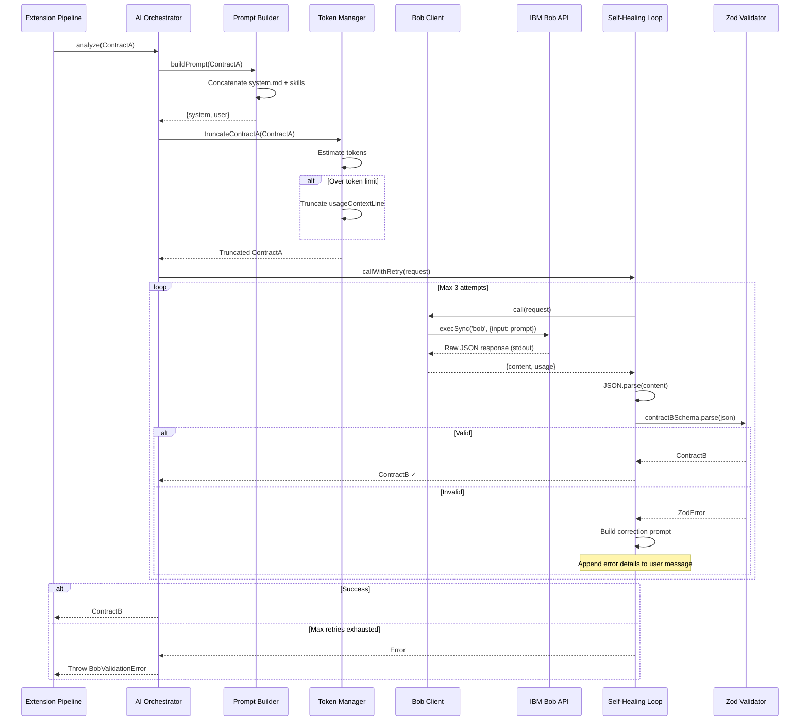
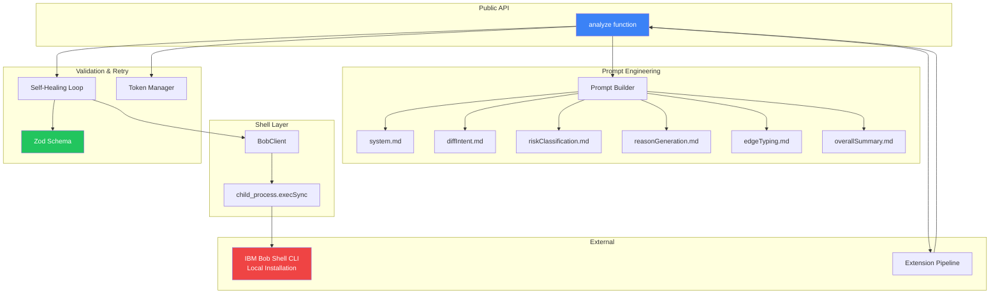
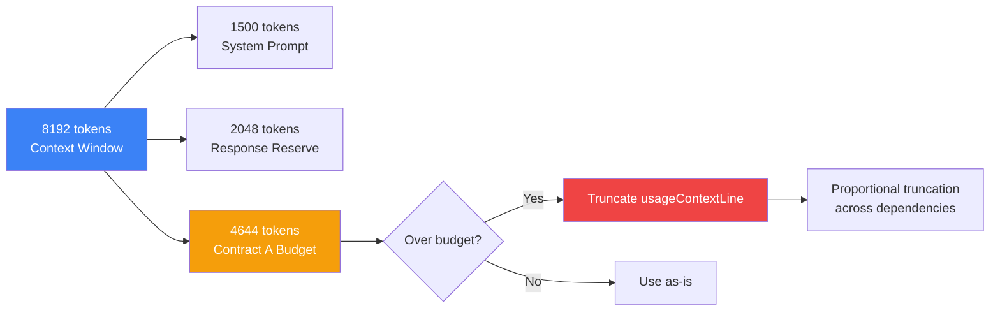
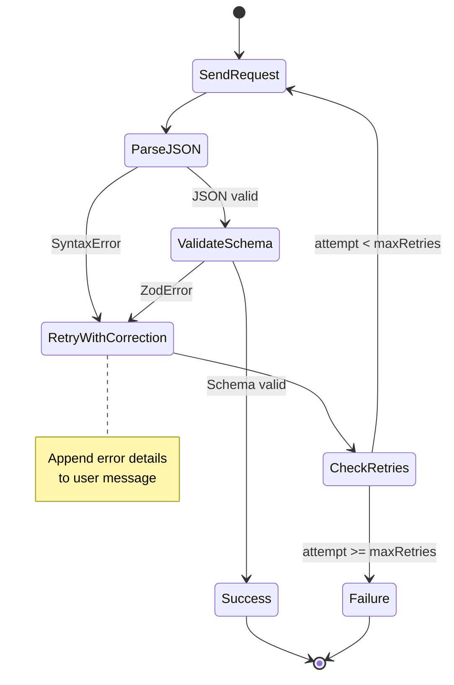

# AI Orchestrator Architecture

## System Overview

The AI Orchestrator acts as the **semantic intelligence layer** in the Blast Radius pipeline. It transforms structural AST data into risk-annotated insights by leveraging IBM Bob's language understanding capabilities.

## Data Flow



## Component Architecture



## Skill Implementation Mapping

| Bob Skill | Prompt File | Validation | Output Field |
|-----------|-------------|------------|--------------|
| **Skill 1**: DiffIntentAnalysis | [`diffIntent.md`](./src/bob/prompts/diffIntent.md) | Internal reasoning | Informs risk classification |
| **Skill 2**: RiskClassification | [`riskClassification.md`](./src/bob/prompts/riskClassification.md) | `RiskEnum` in Zod | `nodes[].risk` |
| **Skill 3**: ReasonGeneration | [`reasonGeneration.md`](./src/bob/prompts/reasonGeneration.md) | Prefix validation | `nodes[].reason` |
| **Skill 4**: EdgeTypeClassification | [`edgeTyping.md`](./src/bob/prompts/edgeTyping.md) | `EdgeTypeEnum` in Zod | `edges[].type` |
| **Skill 5**: OverallSummary | [`overallSummary.md`](./src/bob/prompts/overallSummary.md) | String validation | `overallRiskScore`, `summary` |
| **Skill 6**: PackageContextWeighting | [`riskClassification.md`](./src/bob/prompts/riskClassification.md) | Implicit in risk | Affects `nodes[].risk` |
| **Skill 7**: SelfHealingOutput | [`selfHealingLoop.ts`](./src/retry/selfHealingLoop.ts) | Retry logic | Error recovery |

## Token Budget Management



**Truncation Strategy:**
1. Never drop entire dependencies (preserves graph structure)
2. Truncate `usageContextLine` proportionally across all dependencies
3. Add `...` suffix to indicate truncation
4. Preserve `filePath`, `packageName`, `importedSymbols` (critical for risk classification)

## Error Handling Strategy



**Error Categories:**

| Error Type | Retry? | User Action |
|------------|--------|-------------|
| Bob Shell not installed | No | Install Bob Shell from bob.ibm.com/docs/shell |
| Process timeout | No | Increase BOB_TIMEOUT |
| Buffer overflow | No | Reduce Contract A size or increase maxBuffer |
| JSON parse error | Yes (max 3) | Bob corrects format |
| Zod validation error | Yes (max 3) | Bob corrects schema |
| Shell execution error | No | Check Bob Shell logs and version |

## Configuration Management

### Installation Requirement

Bob Shell must be installed locally on the user's machine before the extension can work. This follows a "Bring Your Own CLI" (BYOC) pattern, similar to Docker Extension or GitLens.

**Installation:**
```bash
curl -fsSL https://bob.ibm.com/download/bobshell.sh | bash
```

**Pre-flight Check:**
The BobClient automatically checks for Bob Shell installation:
```typescript
private checkBobInstalled(): void {
  try {
    execSync('bob --version', { stdio: 'ignore' });
  } catch (error) {
    throw new Error(
      'IBM Bob Shell is not installed or not in PATH. ' +
      'Install it from: https://bob.ibm.com/docs/shell'
    );
  }
}
```

**Extension Integration:**
```typescript
import { execSync } from 'child_process';
import * as vscode from 'vscode';

export function ensureBobShellInstalled(): boolean {
  try {
    execSync('bob --version', { stdio: 'ignore' });
    return true;
  } catch (error) {
    vscode.window.showErrorMessage(
      'IBM Bob Shell is required for Blast Radius analysis.',
      'Install Bob Shell'
    ).then(selection => {
      if (selection === 'Install Bob Shell') {
        vscode.env.openExternal(vscode.Uri.parse('https://bob.ibm.com/docs/shell'));
      }
    });
    return false;
  }
}
```

### Environment Variables

```bash
# Bob Shell authentication is handled locally via IBM SSO
# No API keys or endpoints needed

# Optional configuration
export BOB_MODEL="granite-13b-chat"  # or granite-34b-chat
export BOB_TIMEOUT="60000"           # milliseconds (default: 60000)
```

**Note:** `BOB_ENDPOINT`, `BOB_API_KEY`, and `BOB_MAX_RETRIES` are no longer used. Bob Shell handles authentication locally.

### Runtime Configuration

```typescript
// Explicit configuration (overrides env vars)
const contractB = await analyze(contractA, {
  model: 'granite-34b-chat',
  maxRetries: 5,
  onRetry: (attempt, error) => {
    console.log(`Retry ${attempt}: ${error.message}`);
  }
});
```

## Performance Characteristics

### Latency Profile

| Scenario | Expected Time | Notes |
|----------|---------------|-------|
| **Success (no retry)** | 2-5s | Local process + Bob inference |
| **1 retry** | 4-10s | Double the latency |
| **2 retries** | 6-15s | Triple the latency |
| **Max retries** | 8-20s | User sees loading state |

### Token Usage

| Component | Typical Tokens | Max Tokens |
|-----------|----------------|------------|
| System prompt | ~1500 | ~2000 |
| Contract A (small) | ~500 | - |
| Contract A (medium) | ~2000 | - |
| Contract A (large) | ~4000 | 4644 (truncated) |
| Response | ~500 | 2048 (reserved) |
| **Total** | ~4500 | 8192 (limit) |

### Throughput

- **Sequential**: 1 analysis per 2-5s
- **Parallel** (future): Multiple concurrent Bob Shell processes
- **Batch** (future): Process multiple files in single request

## Security Considerations

### Local Authentication

Bob Shell handles authentication locally via IBM SSO - no API keys needed in the code:

```typescript
// ✅ Good: No API keys required
const client = new BobClient({
  model: 'granite-13b-chat',
  timeout: 60000
});

// ✅ Good: Authentication handled by Bob Shell
// User authenticates once during Bob Shell installation
```

**Benefits:**
- No API keys to manage or rotate
- No risk of key exposure in code or logs
- Authentication handled by IBM SSO
- Works offline after initial authentication

### Input Sanitization

- Contract A is JSON-serialized (no injection risk)
- Zod validates all Bob outputs (no XSS risk)
- File paths are workspace-relative (no path traversal)

### Output Validation

- All enum values strictly validated
- No arbitrary code execution in `reason` strings
- Node IDs sanitized before use in Mermaid

## Testing Strategy

### Unit Tests

```typescript
// schemas/contractB.zod.spec.ts
describe('contractBSchema', () => {
  it('validates canonical example', () => {
    const example = require('../examples/contract-b.example.json');
    expect(() => contractBSchema.parse(example)).not.toThrow();
  });

  it('rejects invalid risk enum', () => {
    const invalid = { ...example, overallRiskScore: 'INVALID' };
    expect(() => contractBSchema.parse(invalid)).toThrow(ZodError);
  });
});

// bob/promptBuilder.spec.ts
describe('buildPrompt', () => {
  it('concatenates all prompt files in order', () => {
    const { system } = buildPrompt(contractA);
    expect(system).toContain('You are an enterprise software risk evaluator');
    expect(system).toContain('DiffIntentAnalysis');
    expect(system).toContain('RiskClassification');
  });
});
```

### Integration Tests

```typescript
// index.spec.ts
describe('analyze', () => {
  let mockServer: Server;

  beforeAll(() => {
    mockServer = createMockBobServer();
  });

  it('returns valid Contract B for canonical input', async () => {
    const contractA = require('./examples/contract-a.example.json');
    const contractB = await analyze(contractA, {
      endpoint: 'http://localhost:8080'
    });

    expect(contractB.overallRiskScore).toBe('CRITICAL');
    expect(contractB.nodes).toHaveLength(4);
  });

  afterAll(() => {
    mockServer.close();
  });
});
```

## Monitoring & Observability

### Metrics to Track

```typescript
interface BobMetrics {
  totalCalls: number;
  successfulCalls: number;
  retriedCalls: number;
  failedCalls: number;
  averageLatency: number;
  p95Latency: number;
  totalTokensUsed: number;
  averageTokensPerCall: number;
}
```

### Logging Events

```typescript
// Info level
logger.info('Bob analysis started', { targetFile, dependencyCount });
logger.info('Bob analysis completed', { duration, tokenUsage });

// Warn level
logger.warn('Bob retry attempt', { attempt, error, correction });
logger.warn('Token truncation applied', { original, truncated });

// Error level
logger.error('Bob analysis failed', { error, maxRetries, contractA });
```

## Deployment Checklist

### Pre-deployment

- [ ] All environment variables documented
- [ ] API key rotation procedure documented
- [ ] Error messages are user-friendly
- [ ] Logging integrated with extension
- [ ] Token limits tested with large fixtures

### Post-deployment

- [ ] Monitor success rate (target: >95%)
- [ ] Monitor average latency (target: <5s)
- [ ] Monitor retry rate (target: <10%)
- [ ] Set up alerts for API errors
- [ ] Track token usage for cost analysis

## Future Enhancements

### Phase 2 (v0.2)

1. **Streaming Responses**: Stream Contract B nodes as generated
2. **Response Caching**: Cache by hash of Contract A
3. **Batch Processing**: Analyze multiple files in one request
4. **Confidence Scores**: Add `confidence: number` to each node

### Phase 3 (v0.3)

1. **Multi-Model Support**: A/B test different Bob variants
2. **Prompt Versioning**: Track prompt changes and accuracy
3. **Transitive Dependencies**: Support multi-hop chains
4. **Custom Risk Rules**: User-defined package weighting

## References

- [Implementation Plan](./IMPLEMENTATION_PLAN.md) - Detailed component specs
- [Bob Skills Spec](../visualizer/BOB-SKILLS-SPEC.md) - What Bob must produce
- [Contract Documentation](../docs/CONTRACTS.md) - Data contract definitions
- [README](./README.md) - Usage and API documentation