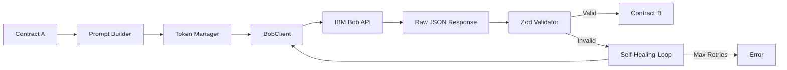

# IBM Bob AI Orchestrator - Implementation Plan

## Overview

The AI Orchestrator is the bridge between the AST graph and semantic risk evaluation. It translates Contract A (structural data) into a system prompt, sends it to IBM Bob, validates the response, and returns Contract B (risk-annotated graph data).

## Architecture



## Component Breakdown

### 1. Zod Schema (`schemas/contractB.zod.ts`)

**Purpose:** Runtime validation of Bob's JSON output against Contract B schema.

**Implementation Details:**
- Mirror [`shared/contracts/contract-b.schema.json`](../shared/contracts/contract-b.schema.json)
- Use Zod's enum validators for `risk` and `edge.type` fields
- Enforce required fields and additionalProperties: false
- Export typed schema for use in self-healing loop

**Key Validations:**
```typescript
const RiskEnum = z.enum(["TARGET", "CRITICAL", "WARNING", "LOW_RISK", "SAFE"]);
const EdgeTypeEnum = z.enum(["breaking-dependency", "warning-dependency", "safe-dependency"]);

const NodeSchema = z.object({
  id: z.string(),
  filePath: z.string(),
  packageName: z.string(),
  label: z.string(),
  risk: RiskEnum,
  reason: z.string()
});

const EdgeSchema = z.object({
  from: z.string(),
  to: z.string(),
  type: EdgeTypeEnum
});

export const contractBSchema = z.object({
  targetFile: z.string(),
  targetPackage: z.string(),
  overallRiskScore: RiskEnum,
  summary: z.string(),
  nodes: z.array(NodeSchema),
  edges: z.array(EdgeSchema)
}).strict();
```

**Error Handling:**
- On validation failure, ZodError provides detailed path and message
- Self-healing loop uses error.message to guide Bob's correction

---

### 2. Prompt Builder (`bob/promptBuilder.ts`)

**Purpose:** Assemble the complete system prompt from markdown files and inject Contract A as user message.

**Implementation Strategy:**

```typescript
export interface PromptPair {
  system: string;
  user: string;
}

export function buildPrompt(contractA: ContractA): PromptPair {
  // 1. Read and concatenate all prompt markdown files in order
  const systemPrompt = [
    readFileSync('prompts/system.md', 'utf-8'),
    readFileSync('prompts/diffIntent.md', 'utf-8'),
    readFileSync('prompts/riskClassification.md', 'utf-8'),
    readFileSync('prompts/reasonGeneration.md', 'utf-8'),
    readFileSync('prompts/edgeTyping.md', 'utf-8'),
    readFileSync('prompts/overallSummary.md', 'utf-8')
  ].join('\n\n---\n\n');

  // 2. Serialize Contract A as the user message
  const userPrompt = JSON.stringify(contractA, null, 2);

  return { system: systemPrompt, user: userPrompt };
}
```

**File Reading:**
- Use `path.join(__dirname, 'prompts', filename)` for reliable path resolution
- Cache prompt content in memory after first read (prompts don't change at runtime)
- Strip HTML comments from markdown files before concatenation

**Prompt Order (Critical):**
1. `system.md` - Global persona and output rules
2. `diffIntent.md` - Skill 1: Analyze change type
3. `riskClassification.md` - Skill 2: Assign risk levels
4. `reasonGeneration.md` - Skill 3: Generate human-readable reasons
5. `edgeTyping.md` - Skill 4: Type edges based on destination risk
6. `overallSummary.md` - Skill 5: Compute overall score and summary

---

### 3. Token Manager (`retry/tokenManager.ts`)

**Purpose:** Ensure total prompt size stays under model context window by truncating `usageContextLine` fields.

**Implementation Strategy:**

```typescript
export interface TokenLimits {
  maxContextWindow: number;  // e.g., 8192 for Granite-13b
  systemPromptTokens: number; // estimated from prompt builder
  reserveForResponse: number; // e.g., 2048 tokens for Contract B
}

export function truncateContractA(
  contractA: ContractA,
  limits: TokenLimits
): ContractA {
  // 1. Estimate token count (rough: 1 token ≈ 4 chars)
  const estimateTokens = (text: string) => Math.ceil(text.length / 4);
  
  // 2. Calculate available tokens for user message
  const availableTokens = limits.maxContextWindow 
    - limits.systemPromptTokens 
    - limits.reserveForResponse;
  
  // 3. If under budget, return as-is
  const currentTokens = estimateTokens(JSON.stringify(contractA));
  if (currentTokens <= availableTokens) {
    return contractA;
  }
  
  // 4. Truncate usageContextLine fields proportionally
  const maxLineLength = Math.floor(
    (availableTokens * 4) / contractA.dependencies.length
  );
  
  return {
    ...contractA,
    dependencies: contractA.dependencies.map(dep => ({
      ...dep,
      usageContextLine: dep.usageContextLine.length > maxLineLength
        ? dep.usageContextLine.slice(0, maxLineLength) + '...'
        : dep.usageContextLine
    }))
  };
}
```

**Token Estimation:**
- Use simple heuristic: 1 token ≈ 4 characters (conservative for English)
- For production, consider integrating tiktoken or similar tokenizer
- Never drop entire dependencies - only truncate individual lines

**Default Limits:**
- Granite-13b: 8192 tokens
- System prompt: ~1500 tokens (measured from concatenated prompts)
- Response reserve: 2048 tokens
- Available for Contract A: ~4600 tokens

---

### 4. BobClient (`bob/BobClient.ts`)

**Purpose:** Shell client for IBM Bob CLI with proper error handling and JSON extraction.

**Architecture:** "Bring Your Own CLI" (BYOC) - Bob Shell must be installed locally on user's machine.

**Implementation:**

```typescript
import { execSync } from 'child_process';

export interface BobConfig {
  model?: string;        // e.g., "granite-13b-chat"
  temperature?: number;  // 0.0 for deterministic output
  timeout?: number;      // milliseconds
}

export interface BobRequest {
  system: string;
  user: string;
  model: string;
  temperature: number;
}

export interface BobResponse {
  content: string;  // Raw JSON string from Bob
  usage?: {
    promptTokens: number;
    completionTokens: number;
    totalTokens: number;
  };
}

export class BobClient {
  private config: Required<Omit<BobConfig, 'endpoint' | 'apiKey'>> & { timeout: number };

  constructor(config: BobConfig) {
    this.config = {
      model: 'granite-13b-chat',
      temperature: 0.0,
      timeout: 60000,
      ...config
    };
  }

  async call(request: BobRequest): Promise<BobResponse> {
    // 1. Verify Bob Shell is installed
    this.checkBobInstalled();

    // 2. Combine prompts
    const combinedPrompt = `${request.system}\n\n${request.user}`;

    // 3. Execute Bob via local shell CLI
    const bobOutput = execSync('bob', { 
      input: combinedPrompt,
      encoding: 'utf-8',
      timeout: this.config.timeout,
      maxBuffer: 10 * 1024 * 1024,
      stdio: ['pipe', 'pipe', 'ignore']  // Suppress stderr
    });

    // 4. Extract JSON from response (Bob may output text before/after)
    const response = bobOutput.trim();
    const firstBrace = response.indexOf('{');
    const lastBrace = response.lastIndexOf('}');
    
    if (firstBrace === -1 || lastBrace === -1) {
      throw new Error('No valid JSON found in Bob response');
    }
    
    // Use brace-counting for proper extraction
    let braceCount = 0;
    let endPos = firstBrace;
    for (let i = firstBrace; i < response.length; i++) {
      if (response[i] === '{') braceCount++;
      if (response[i] === '}') {
        braceCount--;
        if (braceCount === 0) {
          endPos = i;
          break;
        }
      }
    }
    
    const jsonContent = response.substring(firstBrace, endPos + 1).trim();

    return {
      content: jsonContent,
      usage: { promptTokens: 0, completionTokens: 0, totalTokens: 0 }
    };
  }

  private checkBobInstalled(): void {
    try {
      execSync('bob --version', { stdio: 'ignore' });
    } catch (error) {
      throw new Error(
        'IBM Bob Shell is not installed. '
        + 'Install from: https://bob.ibm.com/docs/shell'
      );
    }
  }
}
```

**Error Handling:**
- Shell not found: Clear installation instructions
- Timeout: Configurable, default 60s
- Invalid JSON: Uses robust brace-counting extraction
- Stderr suppressed: Avoids IDE companion warnings

**Configuration:**
- Model: Optional, default granite-13b-chat
- Temperature: Fixed at 0.0 for deterministic JSON
- Timeout: Configurable per request
- 401/403: authentication failure
- 429: rate limit (could add retry with backoff)
- 500: Bob service error
- Timeout: configurable, default 60s

**Configuration:**
- Read from environment variables with fallbacks
- Support model override for testing different Bob variants
- Temperature = 0.0 for deterministic JSON output

---

### 5. Self-Healing Loop (`retry/selfHealingLoop.ts`)

**Purpose:** Wrap BobClient calls with retry logic that feeds validation errors back to Bob.

**Implementation:**

```typescript
import { z } from 'zod';
import { BobClient, BobRequest } from '../bob/BobClient';
import { contractBSchema } from '../schemas/contractB.zod';
import type { ContractB } from '@blast-radius/shared';

export interface RetryConfig {
  maxRetries: number;
  onRetry?: (attempt: number, error: z.ZodError) => void;
}

export async function callWithRetry(
  client: BobClient,
  request: BobRequest,
  config: RetryConfig = { maxRetries: 3 }
): Promise<ContractB> {
  let lastError: Error | null = null;
  let currentRequest = request;

  for (let attempt = 1; attempt <= config.maxRetries; attempt++) {
    try {
      // 1. Call Bob
      const response = await client.call(currentRequest);
      
      // 2. Parse JSON (may throw SyntaxError)
      const rawJson = JSON.parse(response.content);
      
      // 3. Validate with Zod (may throw ZodError)
      const validated = contractBSchema.parse(rawJson);
      
      // Success!
      return validated;
      
    } catch (error) {
      lastError = error as Error;
      
      if (error instanceof z.ZodError) {
        // Validation failed - prepare correction prompt
        config.onRetry?.(attempt, error);
        
        if (attempt < config.maxRetries) {
          const correctionPrompt = buildCorrectionPrompt(
            currentRequest.user,
            error
          );
          
          currentRequest = {
            ...currentRequest,
            user: correctionPrompt
          };
          
          continue; // Retry with correction
        }
      } else if (error instanceof SyntaxError) {
        // JSON parse failed
        if (attempt < config.maxRetries) {
          const correctionPrompt = buildJsonCorrectionPrompt(
            currentRequest.user,
            error.message
          );
          
          currentRequest = {
            ...currentRequest,
            user: correctionPrompt
          };
          
          continue;
        }
      }
      
      // Other errors or max retries reached
      break;
    }
  }

  throw new Error(
    `Bob failed to produce valid Contract B after ${config.maxRetries} attempts. ` +
    `Last error: ${lastError?.message}`
  );
}

function buildCorrectionPrompt(
  originalPrompt: string,
  zodError: z.ZodError
): string {
  const errorDetails = zodError.errors
    .map(e => `- ${e.path.join('.')}: ${e.message}`)
    .join('\n');

  return `${originalPrompt}

---

CORRECTION REQUIRED:
Your previous response failed schema validation with the following errors:

${errorDetails}

Please re-emit the entire ContractB JSON, fixing exactly these validation issues. 
Ensure all required fields are present and all enum values match the schema exactly.`;
}

function buildJsonCorrectionPrompt(
  originalPrompt: string,
  parseError: string
): string {
  return `${originalPrompt}

---

CORRECTION REQUIRED:
Your previous response was not valid JSON. Parse error: ${parseError}

Please re-emit the entire ContractB JSON as valid, parseable JSON with no markdown fences or commentary.`;
}
```

**Retry Strategy:**
- Attempt 1: Original prompt
- Attempt 2+: Original prompt + validation error details
- Max 3 attempts (configurable)
- Each retry includes full context to avoid confusion

**Error Types Handled:**
1. **ZodError**: Schema validation failed (wrong enum, missing field, etc.)
2. **SyntaxError**: JSON parse failed (Bob added markdown fences, prose, etc.)
3. **Network/API errors**: Propagate immediately (no retry)

---

### 6. Main Orchestrator (`index.ts`)

**Purpose:** Public API that composes all components into the `analyze()` function.

**Implementation:**

```typescript
import type { ContractA, ContractB } from '@blast-radius/shared';
import { BobClient, BobConfig } from './bob/BobClient';
import { buildPrompt } from './bob/promptBuilder';
import { truncateContractA } from './retry/tokenManager';
import { callWithRetry } from './retry/selfHealingLoop';

export interface AnalyzeOptions {
  endpoint?: string;
  apiKey?: string;
  model?: string;
  maxRetries?: number;
  onRetry?: (attempt: number, error: Error) => void;
}

export async function analyze(
  contractA: ContractA,
  options: AnalyzeOptions = {}
): Promise<ContractB> {
  // 1. Load configuration from options or environment
  const config: BobConfig = {
    endpoint: options.endpoint || process.env.BOB_ENDPOINT || '',
    apiKey: options.apiKey || process.env.BOB_API_KEY || '',
    model: options.model || process.env.BOB_MODEL || 'granite-13b-chat',
    temperature: 0.0
  };

  if (!config.endpoint || !config.apiKey) {
    throw new Error(
      'Bob endpoint and API key required. Set BOB_ENDPOINT and BOB_API_KEY environment variables.'
    );
  }

  // 2. Initialize Bob client
  const client = new BobClient(config);

  // 3. Build prompts
  const prompts = buildPrompt(contractA);

  // 4. Truncate if needed (token management)
  const truncated = truncateContractA(contractA, {
    maxContextWindow: 8192,
    systemPromptTokens: Math.ceil(prompts.system.length / 4),
    reserveForResponse: 2048
  });

  // 5. Rebuild user prompt with truncated data
  const finalPrompts = {
    system: prompts.system,
    user: JSON.stringify(truncated, null, 2)
  };

  // 6. Call Bob with retry loop
  const contractB = await callWithRetry(
    client,
    {
      ...finalPrompts,
      model: config.model,
      temperature: config.temperature
    },
    {
      maxRetries: options.maxRetries || 3,
      onRetry: options.onRetry
    }
  );

  // 7. Return validated Contract B
  return contractB;
}

// Re-export types for convenience
export type { ContractA, ContractB } from '@blast-radius/shared';
export { contractBSchema } from './schemas/contractB.zod';
```

**Configuration Priority:**
1. Explicit options passed to `analyze()`
2. Environment variables
3. Defaults

**Environment Variables:**
- `BOB_ENDPOINT` - Required, e.g., `https://bob.ibm.com/v1`
- `BOB_API_KEY` - Required, Bearer token
- `BOB_MODEL` - Optional, default `granite-13b-chat`

---

## Testing Strategy

### Unit Tests

**Test Files:**
- `schemas/contractB.zod.spec.ts` - Validate schema against example fixtures
- `bob/promptBuilder.spec.ts` - Verify prompt assembly and ordering
- `retry/tokenManager.spec.ts` - Test truncation logic
- `retry/selfHealingLoop.spec.ts` - Mock retry scenarios

**Fixtures:**
- Use [`examples/contract-a.example.json`](./examples/contract-a.example.json) as input
- Use [`examples/contract-b.example.json`](./examples/contract-b.example.json) as expected output
- Create malformed JSON fixtures for retry testing

### Integration Tests

**Mock Bob Server:**
```typescript
// test/mockBobServer.ts
import express from 'express';

const app = express();
app.use(express.json());

app.post('/chat/completions', (req, res) => {
  const contractB = require('../examples/contract-b.example.json');
  res.json({
    choices: [{ message: { content: JSON.stringify(contractB) } }],
    usage: { promptTokens: 1500, completionTokens: 500, totalTokens: 2000 }
  });
});

export const mockServer = app.listen(8080);
```

**Test Scenarios:**
1. ✅ Valid Contract A → Valid Contract B
2. ✅ Malformed JSON → Retry → Valid Contract B
3. ✅ Schema violation → Retry with correction → Valid Contract B
4. ❌ Max retries exhausted → Error thrown
5. ✅ Large Contract A → Truncation → Valid Contract B

---

## Bob Shell Integration

### Installation & Pre-flight Check

**User-facing (in extension):**
```typescript
import { execSync } from 'child_process';
import * as vscode from 'vscode';

export function ensureBobShellInstalled(): boolean {
  try {
    execSync('bob --version', { stdio: 'ignore' });
    return true;
  } catch (error) {
    vscode.window.showErrorMessage(
      'IBM Bob Shell is required for Blast Radius analysis.',
      'Install Bob Shell'
    ).then(selection => {
      if (selection === 'Install Bob Shell') {
        vscode.env.openExternal(
          vscode.Uri.parse('https://bob.ibm.com/docs/shell')
        );
      }
    });
    return false;
  }
}
```

**Installation (for users):**
```bash
curl -fsSL https://bob.ibm.com/download/bobshell.sh | bash
bob --accept-license
```

**Requirements:**
- Node.js 22.15 or higher
- Internet connection (for Bob Shell download and IBM SSO)
- Local installation (no API keys needed)

### Why Local CLI?

Bob Shell is a local CLI tool, not a remote HTTP API:
- **No API keys needed** - Authentication via local IBM SSO
- **No rate limits** - Users control their own instance
- **Offline capable** - Once installed, works without internet for cached models
- **BYOC pattern** - Similar to Docker Extension or GitLens requiring local tools

---

## Prompt Engineering Guidelines

### System Prompt Structure

Each markdown file in `prompts/` follows this pattern:

```markdown
<!-- TODO comment with skill reference -->
<!-- Spec: ../../../visualizer/BOB-SKILLS-SPEC.md#skill-N -->

[Skill description and rules]

[Examples or tables]

[Edge cases]
```

**Key Principles:**
1. **Deterministic Output**: Temperature = 0.0, strict JSON schema
2. **No Prose**: Bob must output ONLY valid JSON, no markdown fences
3. **Enum Enforcement**: Repeat valid enum values in every relevant prompt section
4. **Prefix Requirements**: Every `reason` must start with `COMPILE BREAK:`, `LOGICAL RUNTIME WARN:`, or `SAFE PASSIVE:`
5. **Package Context**: Emphasize the weighting heuristic for `*.analytics.*` vs `*.api.controllers.*`

### Prompt Maintenance

**When to Update Prompts:**
- Bob consistently misclassifies a specific pattern → Update `riskClassification.md`
- Reasons are too vague → Add examples to `reasonGeneration.md`
- Edge types are wrong → Clarify mapping in `edgeTyping.md`

**Testing Prompt Changes:**
1. Update markdown file
2. Run against canonical fixture: `npm test`
3. Verify output matches expected Contract B structure
4. Check that all enum values are valid
5. Ensure reasons have correct prefixes

---

## Error Handling & Observability

### Error Types

| Error | Cause | Recovery |
|-------|-------|----------|
| `BobNotInstalledError` | Bob Shell missing or not in PATH | User must install from bob.ibm.com/docs/shell |
| `BobTimeoutError` | Request > configured timeout | Retry or increase BOB_TIMEOUT |
| `BobValidationError` | Schema mismatch after max retries | Log error, show user-friendly message |
| `TokenLimitError` | Contract A too large even after truncation | Reduce dependency count or increase limit |
| `BobShellError` | Unexpected Bob Shell CLI error | Check Bob Shell logs and version |

### Logging

```typescript
export interface Logger {
  info(message: string, meta?: object): void;
  warn(message: string, meta?: object): void;
  error(message: string, meta?: object): void;
}

// In analyze():
logger.info('Starting Bob analysis', { 
  targetFile: contractA.targetFile,
  dependencyCount: contractA.dependencies.length 
});

logger.warn('Retrying Bob call', { 
  attempt: 2,
  error: zodError.message 
});

logger.error('Bob analysis failed', { 
  error: error.message,
  maxRetries: 3 
});
```

**Integration with Extension:**
- Extension's `outputChannel.ts` provides logger implementation
- All Bob interactions logged to VS Code Output panel
- Token usage logged for debugging context window issues

---

## Performance Considerations

### Latency Budget

| Component | Expected Time |
|-----------|---------------|
| Prompt building | < 10ms |
| Token truncation | < 50ms |
| Bob API call | 2-5s (network + inference) |
| Zod validation | < 10ms |
| **Total (success)** | **~2-5s** |
| **Total (1 retry)** | **~4-10s** |

### Optimization Opportunities

1. **Prompt Caching**: Cache concatenated system prompt in memory
2. **Parallel Requests**: If analyzing multiple files, batch requests
3. **Streaming**: Consider streaming response for faster perceived latency
4. **Token Estimation**: Use proper tokenizer instead of char/4 heuristic

---

## Deployment Checklist

- [ ] Bob Shell installation instructions documented in README
- [ ] Pre-flight check implemented in extension
- [ ] All prompt files committed and version-controlled
- [ ] Zod schema matches JSON schema exactly
- [ ] Example fixtures validate successfully
- [ ] Unit tests pass with 100% coverage
- [ ] Integration test with mock Bob Shell passes
- [ ] Error messages are user-friendly
- [ ] Logging integrated with extension's output channel
- [ ] Token limits tested with large fixtures
- [ ] Retry logic tested with malformed responses
- [ ] Bob Shell installation requirement documented

---

## Future Enhancements

### v0.2 Scope

1. **Confidence Scores**: Add `confidence: number` to each node
2. **Transitive Dependencies**: Support multi-hop dependency chains
3. **Caching**: Hash Contract A → cache Contract B for repeated calls
4. **Streaming**: Stream Contract B nodes as they're generated
5. **Multi-Model Support**: A/B test Granite-13b vs Granite-34b
6. **Prompt Versioning**: Track prompt changes and their impact on accuracy

### Monitoring Metrics

- **Success Rate**: % of calls that succeed without retry
- **Retry Rate**: % of calls requiring 1+ retries
- **Average Latency**: p50, p95, p99 response times
- **Token Usage**: Track prompt/completion tokens for cost analysis
- **Validation Errors**: Most common Zod error paths

---

## References

- [Contract B Schema](../shared/contracts/contract-b.schema.json)
- [Bob Skills Specification](../visualizer/BOB-SKILLS-SPEC.md)
- [Contract Documentation](../docs/CONTRACTS.md)
- [Example Fixtures](./examples/)