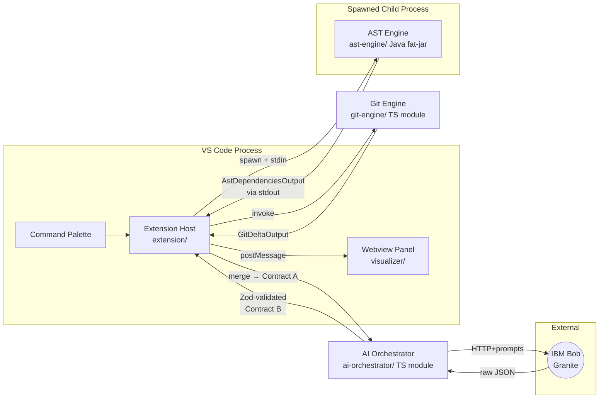

# Architecture

## High-level data flow

The system runs as a five-component pipeline, glued together by four strict JSON contracts. Each component is independently developable; integration is one-shot at hour ~35.

## Component Boundaries

| Component | Process | Owns |
|---|---|---|
| `extension/` | VS Code extension host (Node) | Command registration, webview lifecycle, pipeline sequencing, **Contract A assembly** |
| `git-engine/` | In-process TS module | Active file resolution, `git diff` parsing, line→symbol mapping |
| `ast-engine/` | **Spawned Java child process** | Full workspace AST + cross-module type resolution |
| `ai-orchestrator/` | In-process TS module | Bob client, prompt composition, Zod validation, retry loop |
| `visualizer/` | **Webview** (sandboxed) | Mermaid rendering, risk styling, user interaction |

## Why each tech choice

- **JavaParser** over tree-sitter: type resolution across Maven modules and JARs in `~/.m2` is non-negotiable for an OSGi codebase like carbon-identity-framework. Tree-sitter only does syntactic parsing.
- **Java fat-jar CLI** for the AST: JVM startup (~1-2 s) is acceptable for a one-shot analysis. Keeping JavaParser out of the extension host avoids embedding the JVM in Electron.
- **Zod** for Bob output: AI models hallucinate JSON formatting. Zod throws on mismatch; the retry loop re-prompts with the error context, so the pipeline self-heals.
- **Vite + React** for the visualizer: webviews require pre-bundled HTML/JS. Vite is the fastest path to a CSP-safe bundle with HMR during dev.
- **Mermaid** for graphs: declarative syntax that maps cleanly from Contract B's nodes/edges shape. No D3 boilerplate.

## Future scope

- **Poly-repo support** with Maven Central JAR resolution — see [OSGI-AND-MAVEN.md](OSGI-AND-MAVEN.md).
- **Pre-commit hook mode** — run the same pipeline headlessly and block commits on `overallRiskScore = CRITICAL`.
- **Language extension** — Kotlin and Scala via the same JVM child process.
