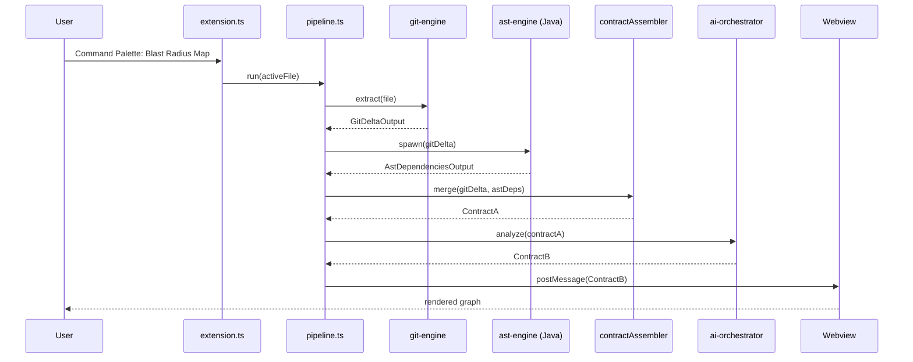

# extension/ — VS Code Core

## Mission

The orchestrator. Registers the `blastRadius.map` command, hosts the webview, sequences the four child components, **merges** `GitDeltaOutput` + `AstDependenciesOutput` into Contract A, and posts Contract B to the visualizer.

## Owner

**Member 1.**

## Tech Stack

- TypeScript 5.x
- `@types/vscode` ≥ 1.85
- Node.js (extension host runtime)
- `vsce` (for packaging the `.vsix`)

## Inputs / Outputs

| Direction | Source/Sink | Contract |
|---|---|---|
| Out | invokes `git-engine` | (no contract; in-process call) |
| In | from `git-engine` | [`GitDeltaOutput`](../shared/types/gitDeltaOutput.ts) |
| Out | spawns `ast-engine` fat-jar | passes `GitDeltaOutput` via CLI args |
| In | from `ast-engine` | [`AstDependenciesOutput`](../shared/types/astDependenciesOutput.ts) (via stdout JSON) |
| **Internal merge** | `contractAssembler.ts` | spreads both into [`ContractA`](../shared/types/contractA.ts) |
| Out | invokes `ai-orchestrator.analyze()` | [`ContractA`](../shared/types/contractA.ts) |
| In | from `ai-orchestrator` | [`ContractB`](../shared/types/contractB.ts) |
| Out | `webview.postMessage()` to `visualizer` | [`ContractB`](../shared/types/contractB.ts) |

See [examples/](./examples/) for each of the four payloads.

## Sequence



## Local Development

```bash
cd extension
npm install        # installs vscode types, etc.
npm run watch      # tsc --watch
```

From the repo root, press **F5** in VS Code to launch the Extension Development Host.

## Mocking Upstream

While other components aren't ready, `pipeline.ts` reads `examples/git-delta-output.example.json` and `examples/ast-dependencies-output.example.json` directly instead of calling M2/M3, and similarly hardcodes `examples/contract-b.example.json` to skip M4. The integration story in [docs/INTEGRATION.md](../docs/INTEGRATION.md) lists each swap-out point.

## Integration Hooks

- Command id: `blastRadius.map`
- Public modules: `pipeline.ts` (the master sequencer) and `contractAssembler.ts` (the merge). Both are import targets for integration tests.

## Open Questions

- Whether to register a `vscode.commands.registerTextEditorCommand` (active-editor-bound) vs `registerCommand` (workspace-bound). Currently leaning toward TextEditorCommand for clearer UX.
- Whether to keep a single persistent webview panel or spawn a new one per run.
