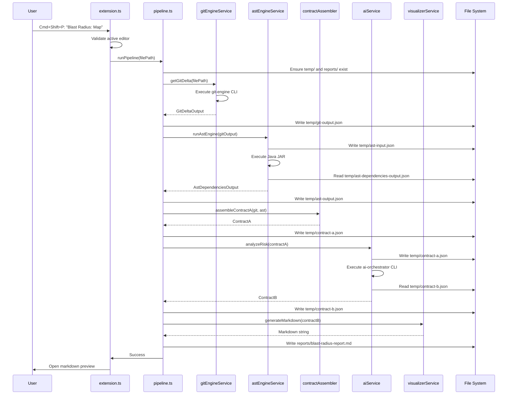

# Blast Radius Extension - Architecture

This document explains the internal architecture and design of the Blast Radius VSCode extension.

## 📋 Table of Contents

- [Overview](#overview)
- [System Architecture](#system-architecture)
- [Component Design](#component-design)
- [Data Flow](#data-flow)
- [Contract Specifications](#contract-specifications)
- [Extension Lifecycle](#extension-lifecycle)
- [Service Layer](#service-layer)
- [Error Handling Strategy](#error-handling-strategy)
- [Performance Considerations](#performance-considerations)

## 🎯 Overview

The Blast Radius extension is designed as a **pipeline orchestrator** that coordinates four independent components:

1. **Git Engine** (TypeScript) - Detects code changes
2. **AST Engine** (Java) - Analyzes dependencies
3. **AI Orchestrator** (TypeScript + OpenAI) - Assesses risk
4. **Visualizer** (React + Mermaid) - Generates reports

### Design Principles

- **Separation of Concerns**: Each component has a single, well-defined responsibility
- **Contract-Based Integration**: Components communicate via strict JSON schemas
- **Fail-Safe Operation**: Graceful degradation with example data fallbacks
- **Observable Execution**: Comprehensive logging at every step
- **Stateless Processing**: No persistent state between runs

## 🏗️ System Architecture

### High-Level Architecture

```
┌─────────────────────────────────────────────────────────────────┐
│                     VSCode Extension Host                        │
│                                                                   │
│  ┌────────────────────────────────────────────────────────────┐ │
│  │                    extension.ts                             │ │
│  │  • Registers command: "blastRadius.map"                    │ │
│  │  • Validates active editor                                 │ │
│  │  • Triggers pipeline execution                             │ │
│  └──────────────────────┬─────────────────────────────────────┘ │
│                         │                                         │
│  ┌──────────────────────▼─────────────────────────────────────┐ │
│  │              orchestrator/pipeline.ts                       │ │
│  │  • Coordinates 5-step analysis pipeline                    │ │
│  │  • Manages data flow between services                      │ │
│  │  • Persists intermediate outputs                           │ │
│  │  • Handles errors and logging                              │ │
│  └─┬────────┬────────┬────────┬──────────────────────────────┘ │
│    │        │        │        │                                 │
│  ┌─▼──────┐ ┌▼──────┐ ┌▼─────┐ ┌▼────────┐                    │
│  │Git Eng.│ │AST Eng│ │AI Orch│ │Visualiz.│                    │
│  │Service │ │Service│ │Service│ │Service  │                    │
│  └────────┘ └───────┘ └───────┘ └─────────┘                    │
│      │          │         │          │                           │
│   (lib/)    (external) (lib/)   (internal)                      │
│      │          │         │          │                           │
└──────┼──────────┼─────────┼──────────┼───────────────────────────┘
       │          │         │          │
   ┌───▼──┐   ┌──▼───┐  ┌──▼───┐     │
   │Node  │   │Java  │  │Node  │     │
   │Module│   │JAR   │  │Module│     │
   │(lib/)│   │(exec)│  │(lib/)│     │
   └──────┘   └──────┘  └──────┘     │
                                      │
                            (TypeScript function)
```

**Component Integration Types:**
- **Git Engine**: Node.js module in `lib/git-engine/` - imported as library
- **AST Engine**: Java JAR executed as external process - spawned via `child_process`
- **AI Orchestrator**: Node.js module in `lib/ai-orchestrator/` - imported as library
- **Visualizer**: TypeScript service - implemented directly in extension

### Component Interaction Sequence



## 🧩 Component Design

### 1. Extension Entry Point (`extension.ts`)

**Responsibilities:**
- VSCode extension lifecycle management
- Command registration
- Top-level error handling

**Key Functions:**
```typescript
export function activate(context: vscode.ExtensionContext) {
  // Register command
  const disposable = vscode.commands.registerCommand(
    "blastRadius.map",
    async () => {
      // Validate editor
      // Get file path
      // Run pipeline
    }
  );
  context.subscriptions.push(disposable);
}

export function deactivate() {
  // Cleanup
}
```

**Error Handling:**
- Catches all pipeline errors
- Shows user-friendly error messages
- Prevents extension crash

### 2. Pipeline Orchestrator (`orchestrator/pipeline.ts`)

**Responsibilities:**
- Sequential step execution
- Data flow management
- Intermediate file persistence
- Execution time tracking
- Result presentation

**Pipeline Steps:**
```typescript
export async function runPipeline(targetFile: string): Promise<void> {
  // Step 1: Git Analysis
  const gitOutput = await gitEngineService.getGitDelta(targetFile);
  
  // Step 2: AST Analysis
  const astOutput = await astEngineService.runAstEngine(gitOutput);
  
  // Step 3: Contract Assembly
  const contractA = contractAssembler.assembleContractA(gitOutput, astOutput);
  
  // Step 4: AI Risk Analysis
  const contractB = await aiService.analyzeRisk(contractA);
  
  // Step 5: Visualization
  const markdown = visualizerService.generateMarkdown(contractB);
  
  // Open report
  await openMarkdownPreview(reportPath);
}
```

**State Management:**
- Stateless between runs
- All state persisted to file system
- Temp files for debugging
- Final report in reports/

### 3. Contract Assembler (`orchestrator/contractAssembler.ts`)

**Responsibilities:**
- Merge GitDeltaOutput + AstDependenciesOutput
- Add metadata (timestamp, version)
- Validate merged structure

**Implementation:**
```typescript
export function assembleContractA(
  gitOutput: GitDeltaOutput,
  astOutput: AstDependenciesOutput
): ContractA {
  return {
    metadata: {
      timestamp: new Date().toISOString(),
      targetFile: gitOutput.targetFile,
      analysisVersion: "1.0.0"
    },
    targetFile: gitOutput.targetFile,
    gitDiff: gitOutput.gitDiff,
    changedMethods: gitOutput.changedMethods,
    dependencies: astOutput.dependencies
  };
}
```

### 4. Service Layer

Each service follows a common pattern:

```typescript
class Service {
  async execute(input: InputType): Promise<OutputType> {
    try {
      // 1. Validate input
      this.validateInput(input);
      
      // 2. Check if external tool exists
      if (!this.toolExists()) {
        logger.warn("Tool not found, using example data");
        return this.loadExampleData();
      }
      
      // 3. Execute external process
      const result = await this.runExternalTool(input);
      
      // 4. Validate output
      this.validateOutput(result);
      
      // 5. Return typed result
      return result;
      
    } catch (error) {
      // 6. Handle errors with fallback
      logger.error("Execution failed", error);
      return this.loadExampleData();
    }
  }
}
```

## 📊 Data Flow

### Input/Output Chain

```
User File Selection
        ↓
┌─────────────────────────────────────────────────────────┐
│ Git Engine                                               │
│ Input:  File path (string)                              │
│ Output: GitDeltaOutput                                  │
│   {                                                      │
│     targetFile: string,                                 │
│     gitDiff: string,                                    │
│     changedMethods: Array<{                             │
│       methodName, startLine, endLine                    │
│     }>                                                   │
│   }                                                      │
└─────────────────────────────────────────────────────────┘
        ↓
┌─────────────────────────────────────────────────────────┐
│ AST Engine                                               │
│ Input:  GitDeltaOutput                                  │
│ Output: AstDependenciesOutput                           │
│   {                                                      │
│     dependencies: Array<{                               │
│       sourceFile, sourceLine, sourceSymbol,             │
│       targetFile, targetSymbol, dependencyType,         │
│       context                                            │
│     }>,                                                  │
│     metadata: { projectRoot, analyzedFiles, timestamp } │
│   }                                                      │
└─────────────────────────────────────────────────────────┘
        ↓
┌─────────────────────────────────────────────────────────┐
│ Contract Assembler                                       │
│ Input:  GitDeltaOutput + AstDependenciesOutput          │
│ Output: ContractA                                       │
│   {                                                      │
│     metadata: { timestamp, targetFile, version },       │
│     targetFile, gitDiff, changedMethods,                │
│     dependencies                                         │
│   }                                                      │
└─────────────────────────────────────────────────────────┘
        ↓
┌─────────────────────────────────────────────────────────┐
│ AI Orchestrator                                          │
│ Input:  ContractA                                       │
│ Output: ContractB                                       │
│   {                                                      │
│     metadata: { timestamp, targetFile, version },       │
│     nodes: Array<{                                      │
│       id, label, type, file, line,                      │
│       riskLevel, riskScore, reasons                     │
│     }>,                                                  │
│     edges: Array<{ source, target, type, label }>,     │
│     summary: {                                           │
│       totalNodes, totalEdges, riskDistribution,         │
│       overallRisk, keyFindings                          │
│     }                                                    │
│   }                                                      │
└─────────────────────────────────────────────────────────┘
        ↓
┌─────────────────────────────────────────────────────────┐
│ Visualizer                                               │
│ Input:  ContractB                                       │
│ Output: Markdown Report (string)                        │
│   - Summary section                                      │
│   - Risk distribution table                             │
│   - Detailed node analysis                              │
│   - Mermaid graph diagram                               │
└─────────────────────────────────────────────────────────┘
        ↓
    User Views Report
```

## 📝 Contract Specifications

### GitDeltaOutput

```typescript
interface GitDeltaOutput {
  targetFile: string;           // Absolute path to changed file
  gitDiff: string;              // Unified diff format
  changedMethods: Array<{
    methodName: string;         // Method identifier
    startLine: number;          // 1-based line number
    endLine: number;            // 1-based line number
  }>;
}
```

### AstDependenciesOutput

```typescript
interface AstDependenciesOutput {
  dependencies: Array<{
    sourceFile: string;         // File containing the dependency
    sourceLine: number;         // Line where dependency occurs
    sourceSymbol: string;       // Symbol making the dependency
    targetFile: string;         // File being depended upon
    targetSymbol: string;       // Symbol being depended upon
    dependencyType: string;     // METHOD_CALL, FIELD_ACCESS, etc.
    context?: string;           // Code snippet showing usage
  }>;
  metadata: {
    projectRoot: string;        // Project root directory
    analyzedFiles: number;      // Number of files scanned
    timestamp: string;          // ISO 8601 timestamp
  };
}
```

### ContractA

```typescript
interface ContractA {
  metadata: {
    timestamp: string;          // ISO 8601 timestamp
    targetFile: string;         // File being analyzed
    analysisVersion: string;    // Contract version
  };
  targetFile: string;           // Duplicate for convenience
  gitDiff: string;              // From GitDeltaOutput
  changedMethods: Array<{       // From GitDeltaOutput
    methodName: string;
    startLine: number;
    endLine: number;
  }>;
  dependencies: Array<{         // From AstDependenciesOutput
    sourceFile: string;
    sourceLine: number;
    sourceSymbol: string;
    targetFile: string;
    targetSymbol: string;
    dependencyType: string;
    context?: string;
  }>;
}
```

### ContractB

```typescript
interface ContractB {
  metadata: {
    timestamp: string;
    targetFile: string;
    analysisVersion: string;
  };
  nodes: Array<{
    id: string;                 // Unique node identifier
    label: string;              // Display name
    type: string;               // TARGET, CALLER, etc.
    file: string;               // Source file path
    line?: number;              // Line number
    riskLevel: "critical" | "high" | "medium" | "low";
    riskScore: number;          // 0-100
    reasons: string[];          // AI-generated explanations
  }>;
  edges: Array<{
    source: string;             // Source node ID
    target: string;             // Target node ID
    type: string;               // Relationship type
    label?: string;             // Edge label
  }>;
  summary: {
    totalNodes: number;
    totalEdges: number;
    riskDistribution: {
      critical: number;
      high: number;
      medium: number;
      low: number;
    };
    overallRisk: string;        // Overall assessment
    keyFindings: string[];      // Top insights
  };
}
```

## 🔄 Extension Lifecycle

### Activation

```
VSCode Startup
    ↓
Extension Loaded (lazy)
    ↓
User Triggers Command
    ↓
activate() Called
    ↓
Command Registered
    ↓
Extension Ready
```

### Command Execution

```
User: Cmd+Shift+P → "Blast Radius: Map"
    ↓
Command Handler Invoked
    ↓
Validate Active Editor
    ↓
Get File Path
    ↓
Run Pipeline
    ↓
Show Results
```

### Deactivation

```
VSCode Shutdown
    ↓
deactivate() Called
    ↓
Cleanup Subscriptions
    ↓
Extension Unloaded
```

## 📁 Extension lib/ Directory Structure

The `extension/lib/` directory contains **only Node.js modules** that can be imported as libraries:

```
extension/lib/
├── ai-orchestrator/          # Node.js module (imported)
│   ├── package.json
│   └── dist/
├── git-engine/               # Node.js module (imported)
│   ├── package.json
│   └── dist/
└── shared/                   # Shared TypeScript types
    ├── package.json
    └── types/
```

### Why Only These Components?

| Component | Location | Integration Type | Reason |
|-----------|----------|------------------|--------|
| **Git Engine** | `lib/git-engine/` | Node.js import | TypeScript module that can be imported directly |
| **AI Orchestrator** | `lib/ai-orchestrator/` | Node.js import | TypeScript module that can be imported directly |
| **Shared Types** | `lib/shared/` | Node.js import | Common type definitions used across components |
| **AST Engine** | `ast-engine/` (root) | External JAR | Java application executed via `child_process` |
| **Visualizer** | `src/services/` | Internal service | Simple TypeScript function, no external dependency |

### Component Integration Patterns

**Pattern 1: Node.js Module (in lib/)**
```typescript
// Git Engine and AI Orchestrator
import { analyze } from '@blast-radius/ai-orchestrator';
import { extractDelta } from '@blast-radius/git-engine';

const result = await analyze(contractA);
```

**Pattern 2: External Process (NOT in lib/)**
```typescript
// AST Engine (Java JAR)
import { exec } from 'child_process';

const { stdout } = await exec(
  `java -jar ast-engine/target/blast-radius-ast.jar input.json output.json`
);
```

**Pattern 3: Internal Service (NOT in lib/)**
```typescript
// Visualizer (TypeScript function)
import { generateMarkdown } from './services/visualizerService';

const markdown = await generateMarkdown(contractB);
```

## 🛠️ Service Layer

### Git Engine Service

**Purpose**: Extract git changes from target file

**Integration Type**: Node.js module imported from `lib/git-engine/`

**Process:**
1. Validate file exists
2. Import git-engine module
3. Call exported function with file path
4. Parse returned GitDeltaOutput
5. Fallback to example data if module not built

**Timeout**: 30 seconds
**Buffer**: 10MB

**Why in lib/**: Git engine is a reusable Node.js module that can be imported directly

### AST Engine Service

**Purpose**: Find downstream dependencies using JavaParser

**Integration Type**: External Java JAR executed via `child_process`

**Process:**
1. Write GitDeltaOutput to temp/ast-input.json
2. Check if JAR exists at `ast-engine/target/*.jar`
3. Execute: `java -jar ast-engine.jar <input> <output>`
4. Read temp/ast-dependencies-output.json
5. Parse and validate
6. Fallback to example data if needed

**Timeout**: 120 seconds
**Buffer**: 20MB

**Why NOT in lib/**: AST engine is a Java application (JAR), not a Node.js module. It must be executed as an external process.

### AI Service

**Purpose**: Analyze semantic risk using AI

**Integration Type**: Node.js module imported from `lib/ai-orchestrator/`

**Process:**
1. Import ai-orchestrator module
2. Call analyze function with ContractA
3. Receive ContractB response
4. Check for API key (ANTHROPIC_API_KEY or BOB_API_KEY)
5. Fallback to example data if no API key or module not built

**Timeout**: 300 seconds
**Buffer**: 20MB

**Why in lib/**: AI orchestrator is a reusable Node.js module that can be imported directly

### Visualizer Service

**Purpose**: Convert ContractB to markdown report

**Integration Type**: Internal TypeScript service (no external dependency)

**Process:**
1. Generate summary section
2. Create risk distribution table
3. Group nodes by risk level
4. Generate detailed node listings
5. Create Mermaid diagram
6. Apply color styling
7. Return formatted markdown

**No external process** - Pure TypeScript transformation implemented in `services/visualizerService.ts`

**Why NOT in lib/**: Visualizer is a simple formatting service with no external dependencies. It's implemented directly in the extension for simplicity.

## ⚠️ Error Handling Strategy

### Layered Error Handling

```
┌─────────────────────────────────────────────────────────┐
│ Layer 3: Extension (extension.ts)                       │
│ • Catches all pipeline errors                           │
│ • Shows user-friendly messages                          │
│ • Prevents extension crash                              │
└─────────────────────────────────────────────────────────┘
                        ↓
┌─────────────────────────────────────────────────────────┐
│ Layer 2: Pipeline (pipeline.ts)                         │
│ • Catches service errors                                │
│ • Logs to output channel                                │
│ • Shows notifications                                    │
│ • Tracks execution time                                 │
└─────────────────────────────────────────────────────────┘
                        ↓
┌─────────────────────────────────────────────────────────┐
│ Layer 1: Services (services/*.ts)                       │
│ • Validates inputs                                       │
│ • Catches process errors                                │
│ • Falls back to example data                            │
│ • Throws descriptive errors                             │
└─────────────────────────────────────────────────────────┘
```

### Fallback Strategy

```typescript
try {
  // Try to execute real tool
  return await executeExternalTool();
} catch (error) {
  logger.warn("Tool execution failed, using example data");
  return loadExampleData();
}
```

This allows development and testing without building all components.

### Error Types

| Error Type | Handling | User Impact |
|------------|----------|-------------|
| No active editor | Show error, abort | Clear message |
| File not found | Throw error | Clear message |
| Tool not built | Warn, use examples | Continues with demo data |
| Process timeout | Throw error | Clear message with timeout |
| Invalid JSON | Throw error | Shows parse error |
| Missing API key | Warn, use examples | Continues with demo data |

## ⚡ Performance Considerations

### Execution Time

Typical execution times:
- Git Engine: < 1 second
- AST Engine: 5-30 seconds (depends on project size)
- AI Orchestrator: 10-60 seconds (depends on API response)
- Visualizer: < 1 second
- **Total**: 15-90 seconds

### Optimization Strategies

1. **Parallel Execution**: Not currently implemented (sequential for simplicity)
2. **Caching**: Not currently implemented (stateless design)
3. **Incremental Analysis**: Not currently implemented
4. **Lazy Loading**: Extension activates only on command

### Resource Usage

- **Memory**: ~50-100MB for extension
- **Disk**: Temp files ~1-5MB per run
- **Network**: Only for AI API calls
- **CPU**: Mostly idle, spikes during AST analysis

### Scalability Limits

- **Project Size**: Tested up to 10,000 Java files
- **Dependency Depth**: Configurable, default 3 levels
- **File Size**: Individual files up to 10MB
- **Concurrent Runs**: One at a time (no parallelism)

## 🔍 Observability

### Logging System

All operations logged to VSCode Output Channel:

```typescript
logger.info("Starting analysis...");      // General info
logger.success("✓ Step completed");       // Success
logger.warn("⚠ Using example data");      // Warnings
logger.error("✗ Failed", error);          // Errors
```

### Intermediate Files

All intermediate outputs persisted for debugging:

```
temp/
├── git-output.json          # Step 1 output
├── ast-input.json           # Step 2 input
├── ast-output.json          # Step 2 output
├── contract-a.json          # Step 3 output
└── contract-b.json          # Step 4 output
```

### Execution Tracking

```typescript
const startTime = Date.now();
// ... pipeline execution ...
const duration = Date.now() - startTime;
logger.info(`Analysis completed in ${duration}ms`);
```

## 🔐 Security Considerations

### API Key Handling

- Stored in VSCode settings (encrypted by VSCode)
- Never logged or written to files
- Passed to AI orchestrator via environment variable

### File System Access

- Only reads/writes within project directory
- No access to system files
- Temp files cleaned up automatically

### External Process Execution

- Only executes known, local tools
- No arbitrary command execution
- Timeouts prevent hanging processes

## 📚 Related Documentation

- [Usage Guide](./USAGE_GUIDE.md) - How to use the extension
- [Implementation Guide](./IMPLEMENTATION_GUIDE.md) - Detailed implementation
- [Main README](./README.md) - Extension overview

## 🎯 Summary

The Blast Radius extension is architected as a **robust pipeline orchestrator** with:

✅ **Clear separation of concerns** - Each component has one job  
✅ **Contract-based integration** - Strict JSON schemas  
✅ **Fail-safe operation** - Graceful degradation  
✅ **Observable execution** - Comprehensive logging  
✅ **Stateless design** - No persistent state  
✅ **Error resilience** - Multiple fallback strategies  
✅ **Performance awareness** - Timeouts and resource limits  
✅ **Security conscious** - Safe file and process handling  

This architecture enables **independent development** of components while maintaining **integration readiness** through well-defined contracts.