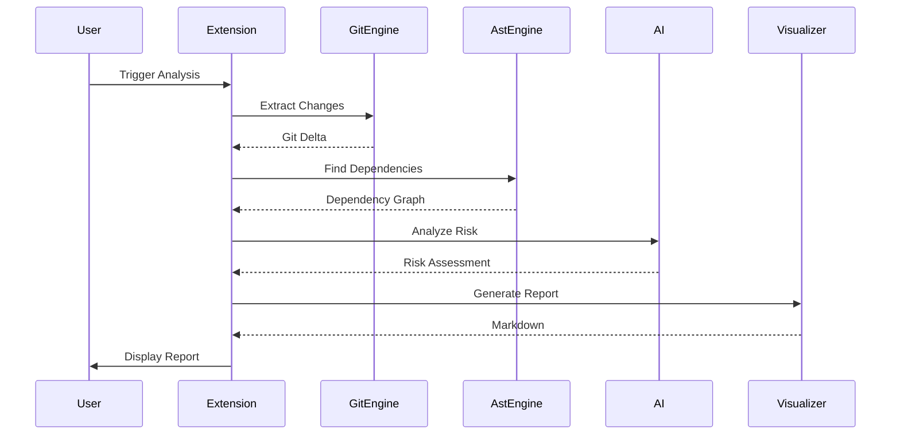

# Blast Radius VSCode Extension

A powerful VSCode extension that analyzes Java code changes and visualizes their impact across your codebase using AI-powered blast radius analysis.

## 📋 Table of Contents

- [Overview](#overview)
- [Features](#features)
- [Quick Start](#quick-start)
- [Documentation](#documentation)
- [Architecture](#architecture)
- [Requirements](#requirements)
- [Installation](#installation)
- [Configuration](#configuration)
- [Usage](#usage)
- [How It Works](#how-it-works)
- [Contributing](#contributing)
- [License](#license)

## 🎯 Overview

The Blast Radius extension helps Java developers understand the impact of their code changes by:

1. **Detecting Changes**: Automatically identifies modified Java files in your Git repository
2. **Analyzing Dependencies**: Uses JavaParser AST analysis to find all dependent code
3. **AI Risk Assessment**: Leverages AI to classify risk levels and generate insights
4. **Visual Impact Map**: Displays an interactive graph showing the blast radius of changes

### What Problem Does It Solve?

When you modify a Java method, class, or field, it's often unclear:
- Which other parts of the codebase depend on your changes
- What the potential impact and risk level is
- Whether your changes might break existing functionality
- Which areas need additional testing or review

This extension answers these questions automatically.

## ✨ Features

### 🔍 Automatic Change Detection
- Monitors Git changes in real-time
- Identifies modified methods, classes, and fields
- Extracts precise line-level changes

### 🔗 Deep Dependency Analysis
- Traces method calls across the entire codebase
- Identifies class references and field usage
- Analyzes inheritance and interface relationships
- Provides code context for each dependency

### 🤖 AI-Powered Risk Classification
- Categorizes changes as LOW, MEDIUM, HIGH, or CRITICAL risk
- Generates human-readable explanations for risk levels
- Identifies potential breaking changes
- Suggests areas requiring attention

### 📊 Interactive Visualization
- Generates markdown reports with Mermaid diagrams
- Color-coded risk levels (red, orange, yellow, green)
- Detailed node information with file locations
- Summary statistics and key findings

### 🛠️ Developer-Friendly
- One-command execution (`Ctrl+Shift+P` → "Blast Radius: Map")
- Comprehensive logging in Output panel
- Intermediate files for debugging
- Graceful fallbacks for development

## 🚀 Quick Start

### 1. Installation

```bash
# Install the extension (VSIX file)
code --install-extension blast-radius-java-x.x.x.vsix
```

### 2. Open Your Java Project

Open any Java project with a Git repository in VSCode.

### 3. Make Changes

Edit any Java file and save your changes.

### 4. Run Analysis

- Press `Ctrl+Shift+P` (Windows/Linux) or `Cmd+Shift+P` (Mac)
- Type: `Blast Radius: Map`
- Press Enter

### 5. View Results

The extension will generate a markdown report showing:
- Overall risk assessment
- Affected files and components
- Dependency graph visualization
- AI-generated insights and recommendations

## 📚 Documentation

### For Users

- **[Usage Guide](./USAGE_GUIDE.md)** - Complete guide for using the extension in Java projects
  - Prerequisites and setup
  - Step-by-step usage instructions
  - Understanding results
  - Best practices
  - Troubleshooting

### For Developers

- **[Implementation Guide](./IMPLEMENTATION_GUIDE.md)** - Technical implementation details
  - File structure and responsibilities
  - Data flow and contracts
  - Component analysis
  - Error handling
  - Development tips

- **[Architecture](./ARCHITECTURE.md)** - System design and architecture
  - High-level architecture
  - Component design
  - Contract specifications
  - Performance considerations
  - Security aspects

## 🏗️ Architecture

### High-Level Overview

```
┌─────────────────────────────────────────────────────────────┐
│                    VSCode Extension                          │
│  ┌──────────────┐  ┌──────────────┐  ┌──────────────┐      │
│  │ Git Engine   │→ │ AST Engine   │→ │ AI Service   │      │
│  │ (Node.js)    │  │ (Java JAR)   │  │ (Node.js)    │      │
│  │ [lib/]       │  │ [external]   │  │ [lib/]       │      │
│  └──────────────┘  └──────────────┘  └──────────────┘      │
│         ↓                  ↓                  ↓              │
│  ┌──────────────────────────────────────────────────┐       │
│  │           Contract Assembler                      │       │
│  └──────────────────────────────────────────────────┘       │
│         ↓                                                     │
│  ┌──────────────────────────────────────────────────┐       │
│  │      Visualizer (TypeScript - internal)           │       │
│  └──────────────────────────────────────────────────┘       │
└─────────────────────────────────────────────────────────────┘
```

**Component Integration:**
- **Git Engine** & **AI Orchestrator**: Node.js modules in `lib/` (imported as libraries)
- **AST Engine**: Java JAR executed as external process (not in `lib/`)
- **Visualizer**: Internal TypeScript service (not in `lib/`)

### Pipeline Flow



## 📦 Requirements

### For Users

- **VSCode**: Version 1.85.0 or higher
- **Java Project**: With Git repository
- **Java Runtime**: JDK 11 or higher (for AST analysis)
- **Node.js**: Version 18 or higher
- **OpenAI API Key**: For AI-powered risk assessment (optional)

### For Developers

- **Node.js**: Version 18 or higher
- **Maven**: Version 3.6 or higher
- **TypeScript**: Version 5.0 or higher
- **Git**: For version control

## 💾 Installation

### Option 1: Install from VSIX (Recommended)

1. Download the latest `.vsix` file from releases
2. Open VSCode
3. Press `Ctrl+Shift+P` (Windows/Linux) or `Cmd+Shift+P` (Mac)
4. Type: `Extensions: Install from VSIX`
5. Select the downloaded `.vsix` file

### Option 2: Build from Source

```bash
# Clone the repository
git clone <repository-url>
cd vscode-blast-radius-java

# Run setup script (builds all components)
./scripts/setup.sh

# Build the extension VSIX
./scripts/build-extension.vsix.sh

# Install the generated VSIX
code --install-extension extension/blast-radius-mapper-*.vsix
```

## ⚙️ Configuration

### VSCode Settings

Configure the extension in VSCode settings (`Ctrl+,` or `Cmd+,`):

```json
{
  // OpenAI API Key for AI analysis (optional)
  "blastRadius.openaiApiKey": "sk-your-api-key-here",
  
  // Path to AST engine JAR (auto-detected if not set)
  "blastRadius.astEnginePath": "/path/to/ast-engine.jar",
  
  // Auto-analyze on file save
  "blastRadius.autoAnalyze": false,
  
  // Maximum dependency depth to analyze
  "blastRadius.maxDepth": 3,
  
  // Include test files in analysis
  "blastRadius.includeTests": false
}
```

### Getting an OpenAI API Key

1. Visit [OpenAI Platform](https://platform.openai.com/)
2. Sign up or log in
3. Navigate to API Keys section
4. Create a new API key
5. Copy and paste into VSCode settings

**Note**: If no API key is provided, the extension will use example data for demonstration.

## 🎮 Usage

### Basic Workflow

1. **Open a Java file** in your project
2. **Make changes** to the code
3. **Save the file** (`Ctrl+S` or `Cmd+S`)
4. **Run the command**:
   - Press `Ctrl+Shift+P` (Windows/Linux) or `Cmd+Shift+P` (Mac)
   - Type: `Blast Radius: Map`
   - Press Enter
5. **View the report** in the markdown preview

### Keyboard Shortcut

You can also use the keyboard shortcut:
- Windows/Linux: `Ctrl+Alt+B`
- Mac: `Cmd+Alt+B`

### Understanding the Report

The generated report includes:

1. **Summary Section**
   - Overall risk level (CRITICAL, HIGH, MEDIUM, LOW)
   - Total nodes and edges analyzed
   - Risk distribution breakdown

2. **Key Findings**
   - AI-generated insights
   - Critical issues identified
   - Recommendations for action

3. **Risk Distribution Table**
   - Count and percentage for each risk level
   - Visual representation

4. **Detailed Node Analysis**
   - Grouped by risk level (Critical → High → Medium → Low)
   - File location and line numbers
   - AI-generated reasons for risk classification

5. **Visual Dependency Graph**
   - Mermaid diagram showing relationships
   - Color-coded by risk level
   - Interactive (zoom, pan in preview)

### Example Output

```markdown
# 🎯 Blast Radius Analysis Report

## 📊 Summary

- **Overall Risk**: CRITICAL
- **Total Nodes**: 5
- **Total Edges**: 4

### Risk Distribution

| Risk Level | Count | Percentage |
|------------|-------|------------|
| 🔴 Critical | 1    | 20%        |
| 🟠 High     | 2    | 40%        |
| 🟡 Medium   | 2    | 40%        |
| 🟢 Low      | 0    | 0%         |

## 🔍 Key Findings

1. Timeout reduction affects critical authentication path
2. 3 high-risk components identified in authentication flow
3. Recommend reverting timeout change or updating all callers

...
```

## 🔧 How It Works

### Step-by-Step Process

1. **Git Analysis** (Git Engine)
   - Detects uncommitted changes in the active file
   - Extracts modified methods and line ranges
   - Generates unified diff format

2. **Dependency Analysis** (AST Engine)
   - Parses Java source code using JavaParser
   - Builds Abstract Syntax Tree (AST)
   - Traces method calls, field access, and class references
   - Finds all code that depends on the changed symbols

3. **Contract Assembly**
   - Merges Git changes and AST dependencies
   - Creates unified data structure (Contract A)
   - Adds metadata (timestamp, version)

4. **AI Risk Assessment** (AI Orchestrator)
   - Analyzes semantic meaning of changes
   - Classifies risk level for each dependency
   - Generates human-readable explanations
   - Identifies potential issues and recommendations

5. **Visualization** (Visualizer)
   - Converts analysis results to markdown
   - Generates Mermaid diagram
   - Applies color coding by risk level
   - Creates formatted report

### Data Contracts

The extension uses strict JSON contracts between components:

- **GitDeltaOutput**: Git changes and modified methods
- **AstDependenciesOutput**: Dependency graph from AST analysis
- **ContractA**: Merged git and AST data
- **ContractB**: AI-enriched analysis with risk levels

See [ARCHITECTURE.md](./ARCHITECTURE.md) for detailed contract specifications.

## 🐛 Troubleshooting

### Common Issues

**Issue**: "No active editor found"
- **Solution**: Open a Java file before running the command

**Issue**: "Git engine not found"
- **Solution**: Build the git-engine component: `cd git-engine && npm install && npm run build`

**Issue**: "AST engine JAR not found"
- **Solution**: Build the AST engine: `cd ast-engine && mvn clean package`

**Issue**: Analysis takes too long
- **Solution**: Reduce `blastRadius.maxDepth` setting or analyze specific files

### Viewing Logs

To see detailed execution logs:
1. Open Output panel: View → Output
2. Select "Blast Radius" from dropdown
3. Review step-by-step execution details

### Debug Mode

The extension automatically saves intermediate outputs to `temp/` directory:
- `git-output.json` - Git changes
- `ast-output.json` - Dependencies
- `contract-a.json` - Merged data
- `contract-b.json` - AI analysis

You can inspect these files for debugging.

## 🤝 Contributing

Contributions are welcome! Please see the main [README.md](../../README.md) for contribution guidelines.

### Development Setup

```bash
# Clone the repository
git clone <repository-url>
cd vscode-blast-radius-java

# Install dependencies
npm install

# Build all components
./scripts/setup.sh

# Open in VSCode
code .

# Press F5 to launch Extension Development Host
```

## 📄 License

MIT License - See [LICENSE](../../LICENSE) for details.

## 🔗 Related Documentation

### Project Documentation
- [Main Project README](../../README.md)
- [Architecture Overview](../../docs/ARCHITECTURE.md)
- [Contracts Specification](../../docs/CONTRACTS.md)
- [Integration Guide](../../docs/INTEGRATION.md)
- [Pipeline Documentation](../../docs/PIPELINE.md)

### Component Documentation
- [AST Engine](../../ast-engine/README.md) - Java dependency analysis
- [Git Engine](../../git-engine/README.md) - Git change detection
- [AI Orchestrator](../../ai-orchestrator/README.md) - Risk assessment
- [Visualizer](../../visualizer/README.md) - Report generation

## 🎓 Learn More

- **[Usage Guide](./USAGE_GUIDE.md)** - Detailed usage instructions for Java developers
- **[Implementation Guide](./IMPLEMENTATION_GUIDE.md)** - Technical implementation details
- **[Architecture](./ARCHITECTURE.md)** - System design and architecture

## 📞 Support

If you encounter issues:
1. Check the [Troubleshooting](#troubleshooting) section
2. Review logs in the Output panel
3. Check `temp/` directory for intermediate outputs
4. Open an issue on GitHub with:
   - VSCode version
   - Java version
   - Error messages from Output panel
   - Sample code (if possible)

---

**Made with ❤️ for Java developers who want to understand the impact of their code changes.**
