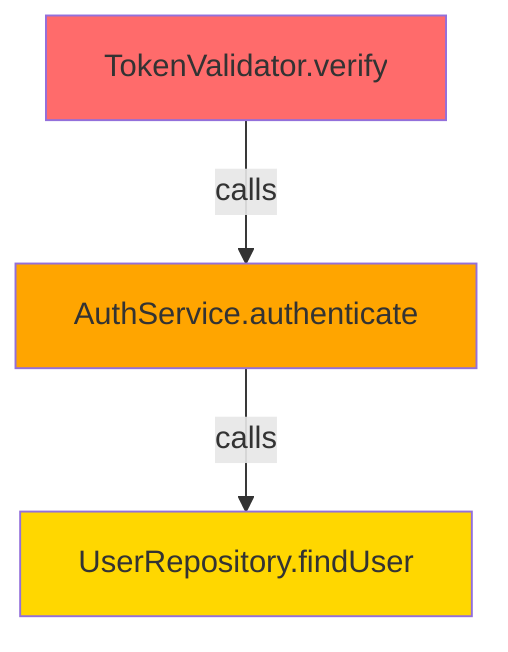

# How to Use Blast Radius Extension in Java Projects

This guide explains how to use the Blast Radius VSCode extension in your Java projects to analyze code changes and understand their impact.

## 📋 Table of Contents

- [Prerequisites](#prerequisites)
- [Installation](#installation)
- [Configuration](#configuration)
- [Basic Usage](#basic-usage)
- [Advanced Features](#advanced-features)
- [Understanding Results](#understanding-results)
- [Best Practices](#best-practices)
- [Troubleshooting](#troubleshooting)

## 🔧 Prerequisites

### 1. Java Project Setup

Your Java project must have:

- **Git Repository**: The project must be under Git version control
- **Java Source Files**: Standard `.java` files in `src/main/java` or similar structure
- **Compilable Code**: The code should compile without errors for best results

### 2. System Requirements

- **VSCode**: Version 1.85.0 or higher
- **Java Runtime**: JDK 11 or higher installed and in PATH
- **Git**: Git CLI installed and configured
- **Node.js**: Version 18 or higher (for running the extension components)
- **OpenAI API Key**: For AI-powered analysis (optional but recommended)

### 3. Verify Java Installation

```bash
# Check Java version
java -version

# Should output: java version "11" or higher
```

## 📦 Installation

### Option 1: Install from VSIX (Recommended)

1. Download the latest `.vsix` file from releases
2. Open VSCode
3. Press `Ctrl+Shift+P` (Windows/Linux) or `Cmd+Shift+P` (Mac)
4. Type: `Extensions: Install from VSIX`
5. Select the downloaded `.vsix` file

### Option 2: Build from Source

```bash
# Clone the repository
git clone <repository-url>
cd vscode-blast-radius-java

# Run setup script (builds all components)
./scripts/setup.sh

# Build the extension VSIX
./scripts/build-extension.vsix.sh

# Install the generated VSIX
code --install-extension extension/blast-radius-mapper-*.vsix
```

## ⚙️ Configuration

### 1. Open VSCode Settings

- Press `Ctrl+,` (Windows/Linux) or `Cmd+,` (Mac)
- Or: File → Preferences → Settings

### 2. Configure Extension Settings

Search for "Blast Radius" and configure:

#### Required Settings

```json
{
  // OpenAI API Key for AI analysis (optional but recommended)
  "blastRadius.openaiApiKey": "sk-your-api-key-here"
}
```

#### Optional Settings

```json
{
  // Path to AST engine JAR (auto-detected if not set)
  "blastRadius.astEnginePath": "/path/to/ast-engine.jar",
  
  // Auto-analyze on file save
  "blastRadius.autoAnalyze": false,
  
  // Maximum dependency depth to analyze
  "blastRadius.maxDepth": 3,
  
  // Include test files in analysis
  "blastRadius.includeTests": false
}
```

### 3. Get OpenAI API Key (Optional)

1. Visit [OpenAI Platform](https://platform.openai.com/)
2. Sign up or log in
3. Navigate to API Keys section
4. Create a new API key
5. Copy and paste into VSCode settings

**Note**: If no API key is provided, the extension will use example data for demonstration purposes.

## 🚀 Basic Usage

### Scenario 1: Analyzing a Single File Change

1. **Open Your Java Project**
   ```bash
   code /path/to/your/java/project
   ```

2. **Make Changes to a Java File**
   - Open any `.java` file
   - Make modifications (e.g., change a method signature, update logic)
   - Save the file (`Ctrl+S` or `Cmd+S`)

3. **Run Blast Radius Analysis**
   - Press `Ctrl+Shift+P` (Windows/Linux) or `Cmd+Shift+P` (Mac)
   - Type: `Blast Radius: Map`
   - Press Enter

4. **View Results**
   - A markdown report will open automatically
   - Shows the impact graph and risk assessment

### Scenario 2: Quick Analysis with Keyboard Shortcut

1. Open a Java file you've modified
2. Press `Ctrl+Alt+B` (Windows/Linux) or `Cmd+Alt+B` (Mac)
3. View the generated report

### Example Workflow

```
┌─────────────────────────────────────────────────────────┐
│ 1. Edit TokenValidator.java                             │
│    - Change timeout from 5000ms to 50ms                 │
│    - Save file                                           │
└─────────────────────────────────────────────────────────┘
                        ↓
┌─────────────────────────────────────────────────────────┐
│ 2. Run Command: "Blast Radius: Map"                     │
│    - Extension detects git changes                      │
│    - Analyzes dependencies                              │
│    - Generates risk assessment                          │
└─────────────────────────────────────────────────────────┘
                        ↓
┌─────────────────────────────────────────────────────────┐
│ 3. View Report                                           │
│    - See which files are affected                       │
│    - Understand risk levels                             │
│    - Review AI-generated insights                       │
└─────────────────────────────────────────────────────────┘
```

## 🎯 Advanced Features

### 1. Analyzing Multiple Files

The extension automatically detects all uncommitted changes in your Git repository:

```bash
# Make changes to multiple files
git status  # Shows modified files

# Run analysis - will analyze all changed files
# Command: "Blast Radius: Map"
```

### 2. Understanding Dependency Types

The extension identifies several types of dependencies:

- **METHOD_CALL**: Direct method invocations
- **FIELD_ACCESS**: Field usage
- **CLASS_REFERENCE**: Class instantiation or type usage
- **INHERITANCE**: Extends or implements relationships
- **ANNOTATION**: Annotation usage

### 3. Risk Level Classification

The AI analyzes changes and assigns risk levels:

- 🔴 **CRITICAL**: High-impact changes requiring immediate attention
- 🟠 **HIGH**: Significant changes that need careful review
- 🟡 **MEDIUM**: Moderate impact, standard review needed
- 🟢 **LOW**: Minor changes with minimal impact

### 4. Viewing Intermediate Outputs

During analysis, the extension creates temporary files:

```
your-project/
├── temp/
│   ├── git-output.json          # Git changes detected
│   ├── ast-input.json           # Input to AST engine
│   ├── ast-output.json          # Dependencies found
│   ├── contract-a.json          # Merged data
│   └── contract-b.json          # AI analysis results
└── reports/
    └── blast-radius-report.md   # Final report
```

You can inspect these files for debugging or deeper understanding.

## 📊 Understanding Results

### Report Structure

The generated markdown report contains:

1. **Summary Section**
   - Overall risk assessment
   - Total nodes and edges analyzed
   - Risk distribution breakdown

2. **Key Findings**
   - AI-generated insights
   - Critical issues identified
   - Recommendations

3. **Risk Distribution Table**
   ```
   | Risk Level | Count | Percentage |
   |------------|-------|------------|
   | Critical   | 1     | 25%        |
   | High       | 2     | 50%        |
   | Medium     | 1     | 25%        |
   | Low        | 0     | 0%         |
   ```

4. **Detailed Node Analysis**
   - Grouped by risk level
   - File location and line numbers
   - AI-generated reasons for risk classification

5. **Visual Graph**
   - Mermaid diagram showing dependencies
   - Color-coded by risk level
   - Interactive (can zoom/pan in preview)

### Reading the Graph



- **Red nodes**: Critical risk
- **Orange nodes**: High risk
- **Yellow nodes**: Medium risk
- **Green nodes**: Low risk
- **Arrows**: Dependency direction (who calls whom)

## 💡 Best Practices

### 1. Run Analysis Before Committing

```bash
# Make your changes
git add .

# Run blast radius analysis
# Command: "Blast Radius: Map"

# Review the impact
# If acceptable, commit
git commit -m "Your message"
```

### 2. Focus on High-Risk Changes

- Review CRITICAL and HIGH risk items first
- Understand why the AI classified them as risky
- Consider adding tests for affected components

### 3. Use for Code Reviews

- Generate blast radius report before creating PR
- Include report in PR description
- Helps reviewers understand impact

### 4. Iterative Analysis

- Make small, focused changes
- Run analysis after each logical change
- Easier to understand and manage impact

### 5. Keep Dependencies Clean

- Minimize coupling between components
- Smaller blast radius = easier to maintain
- Use the tool to identify tight coupling

## 🔧 Troubleshooting

### Issue: "No active editor found"

**Solution**: Open a Java file before running the command.

```bash
# Open a file first
code src/main/java/com/example/MyClass.java

# Then run the command
```

### Issue: "Git engine not found"

**Cause**: The git-engine component hasn't been built.

**Solution**:
```bash
cd git-engine
npm install
npm run build
```

### Issue: "AST engine JAR not found"

**Cause**: The Java AST engine hasn't been compiled.

**Solution**:
```bash
cd ast-engine
mvn clean package
```

### Issue: "No API key configured"

**Cause**: OpenAI API key not set.

**Solution**: The extension will use example data. To enable AI analysis:
1. Get an API key from OpenAI
2. Add to VSCode settings: `blastRadius.openaiApiKey`

### Issue: Analysis takes too long

**Possible causes**:
- Large project with many dependencies
- Deep dependency chains
- Slow API response

**Solutions**:
- Reduce `blastRadius.maxDepth` setting
- Analyze specific files instead of entire project
- Check network connection for API calls

### Issue: Report shows no dependencies

**Possible causes**:
- No uncommitted changes in Git
- File not part of Git repository
- Changes not saved

**Solutions**:
```bash
# Check git status
git status

# Ensure file is saved
# Ensure file has uncommitted changes
```

### Viewing Logs

To see detailed execution logs:

1. Open Output panel: View → Output
2. Select "Blast Radius" from dropdown
3. Review step-by-step execution details

## 📝 Example Use Cases

### Use Case 1: Refactoring a Utility Method

```java
// Before
public class StringUtils {
    public static String format(String input) {
        return input.trim().toLowerCase();
    }
}

// After - Adding validation
public class StringUtils {
    public static String format(String input) {
        if (input == null) {
            throw new IllegalArgumentException("Input cannot be null");
        }
        return input.trim().toLowerCase();
    }
}
```

**Analysis Result**: Shows all callers of `format()` method, identifies which ones might be passing null values, classifies risk based on error handling in callers.

### Use Case 2: Changing API Response Format

```java
// Before
public UserDTO getUser(Long id) {
    return new UserDTO(id, name, email);
}

// After - Adding new field
public UserDTO getUser(Long id) {
    return new UserDTO(id, name, email, phoneNumber);
}
```

**Analysis Result**: Identifies all API consumers, checks if they handle the new field, flags potential breaking changes.

### Use Case 3: Performance Optimization

```java
// Before
public List<Order> getOrders() {
    return orderRepository.findAll(); // Loads all orders
}

// After
public List<Order> getOrders() {
    return orderRepository.findAllWithPagination(0, 100);
}
```

**Analysis Result**: Shows which services call this method, estimates impact on memory usage, identifies potential pagination issues in callers.

## 🎓 Learning Resources

- [Implementation Guide](./IMPLEMENTATION_GUIDE.md) - Technical details
- [Architecture Overview](./ARCHITECTURE.md) - System design
- [AST Engine Documentation](../../ast-engine/README.md) - Dependency analysis
- [AI Orchestrator Documentation](../../ai-orchestrator/README.md) - Risk assessment

## 🤝 Getting Help

If you encounter issues:

1. Check the [Troubleshooting](#troubleshooting) section
2. Review logs in Output panel
3. Check `temp/` directory for intermediate outputs
4. Open an issue on GitHub with:
   - VSCode version
   - Java version
   - Error messages from Output panel
   - Sample code (if possible)

## 📄 License

MIT License - See [LICENSE](../../LICENSE) for details.